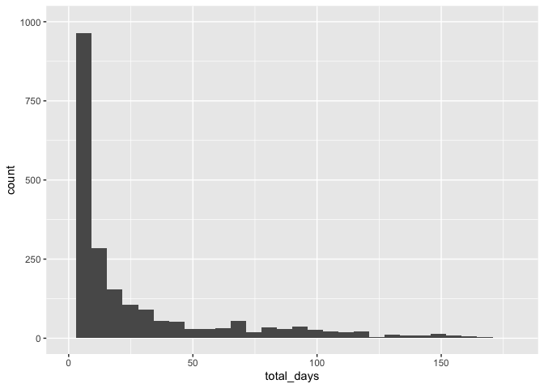
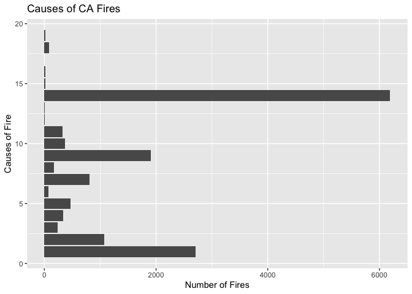
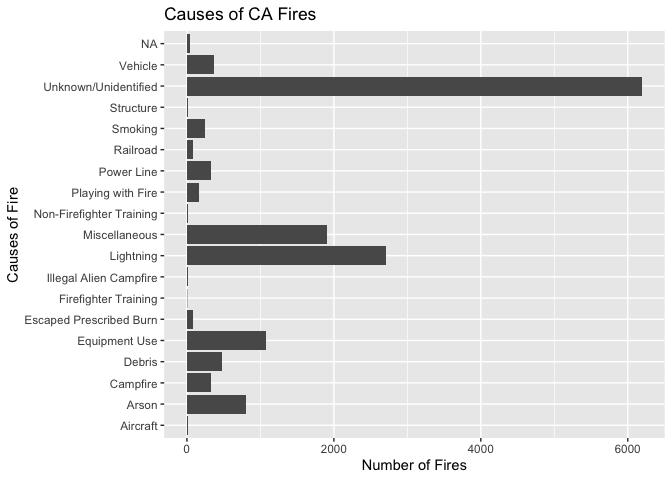
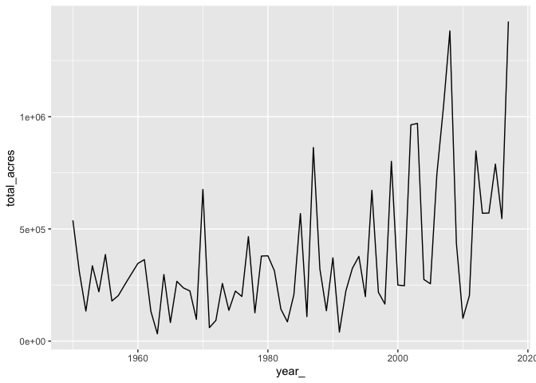
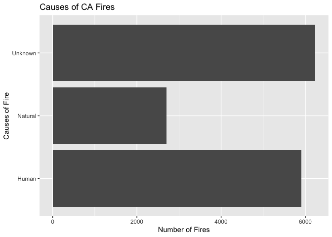

```r
library(gganimate)
library(ggmap)
library(ggridges)
library(ggthemes)
library(knitr)
library(leaflet)
library(lubridate)
library(plotly)
library(scales)
library(tidyverse)
```


## 1
(Max)

This is the College Scorecard Data Set. It has information on higher education institutions in the US, including: information about the institution, academics, admissions, costs, student body, financial aid, and completion. It also has data on earnings post-graduation. This is only the most recent data available (I belive it is 2017). There is another file that has a glossary for all of the terms, since they are abbreviated in this data set. I will work on uploading it. -Max

```r
library(readr)

Most_Recent_Cohorts_Scorecard_Elements <- 
  read_csv("C:/Users/maxda/Downloads/Most-Recent-Cohorts-Scorecard-Elements.csv")

View(Most_Recent_Cohorts_Scorecard_Elements)
```


## 2
(Edwin)

With the recent CA wildfires going on, I was interested in analyzing the history of wildfires in California. I found [this Buzzfeed article](https://www.buzzfeednews.com/article/peteraldhous/california-wildfires-people-climate) that did some analysis, but I think we would be able to expand it a bit more.

Buzzfeed provided the code to clean up and visualize the data the way they did [at this page](https://buzzfeednews.github.io/2018-07-wildfire-trends/) and they also provided their Github repo with their data [here](https://github.com/BuzzFeedNews/2018-07-wildfire-trends).

They retrieved their information from the [California Department of Forestry and Fire Protection (Cal Fire) Fire Perimeters Geodatabase](https://frap.fire.ca.gov/frap-projects/fire-perimeters/) and this will be a good resource since it explains all the variable names.


```r
ca_fires <- read_csv("https://raw.githubusercontent.com/BuzzFeedNews/2018-07-wildfire-trends/master/data/calfire_frap.csv")
ca_damage <- read_csv("https://raw.githubusercontent.com/BuzzFeedNews/2018-07-wildfire-trends/master/data/calfire_damage.csv")
```

Number of days each fire burned

```r
ca_fires %>% 
  mutate(total_days = cont_date - alarm_date) %>% 
  
ggplot(aes(x = total_days)) +
  geom_histogram() +
  xlim(0, 180) +
  ylim(0, 1000) 
```

```
## `stat_bin()` using `bins = 30`. Pick better value with `binwidth`.
```

```
## Warning: Removed 7527 rows containing non-finite values (stat_bin).
```

```
## Warning: Removed 2 rows containing missing values (geom_bar).
```

<!-- -->

Causes of CA Fires - come back and put in the name for each number (see below - Edwin)


```r
cause_names <- tibble(
  cause = c(1, 2, 3, 4, 5, 6, 7, 8, 9, 10, 11, 12, 13, 14, 15, 16, 17, 18, 19),
  cause_name = c("Lightning", "Equipment Use", "Smoking", "Campfire", "Debris", "Railroad", "Arson", "Playing with Fire", "Miscellaneous", "Vehicle", "Power Line", "Firefighter Training", "Non-Firefighter Training", "Unknown/Unidentified", "Structure", "Aircraft", "Volcanic", "Escaped Prescribed Burn", "Illegal Alien Campfire")
)
```


```r
# This uses info above to create new column in original data set to have name for each cause
ca_fires <- ca_fires %>%
  left_join(cause_names, by = "cause")
```


```r
ggplot(ca_fires, aes(x = cause)) +
  geom_bar() +
  coord_flip() +
  labs(title = "Causes of CA Fires", x = "Causes of Fire", y = "Number of Fires")
```

```
## Warning: Removed 42 rows containing non-finite values (stat_count).
```

<!-- -->


```r
ca_fires %>%
  group_by(cause_name) %>%
  count() %>%
  ggplot(aes(x = cause_name, y = n)) +
  geom_col() +
  coord_flip() +
  labs(title = "Causes of CA Fires", x = "Causes of Fire", y = "Number of Fires")
```

<!-- -->


```r
# Summarizing total acres a fire spanned and number of structures destroyed in year
ca_fires %>%
  group_by(year_) %>%
  summarize(total_acres = sum(gis_acres, na.rm = TRUE)) %>%
  left_join(ca_damage, by = c("year_" = "year")) %>%
  arrange(desc(year_))
```

```
## # A tibble: 68 x 3
##    year_ total_acres structures
##    <dbl>       <dbl>      <dbl>
##  1  2017    1424768.      10823
##  2  2016     545985.       1219
##  3  2015     789206.       3097
##  4  2014     570895.        434
##  5  2013     569820.        495
##  6  2012     847715.        205
##  7  2011     202427.        132
##  8  2010     101474.         64
##  9  2009     435840.        123
## 10  2008    1382462.       1122
## # … with 58 more rows
```


```r
ca_fires %>%
  group_by(year_) %>%
  summarize(total_acres = sum(gis_acres, na.rm = TRUE)) %>%
  left_join(ca_damage, by = c("year_" = "year")) %>%
  arrange(desc(year_)) %>%
  ggplot(aes(x = year_, y = total_acres)) +
  geom_line()
```

<!-- -->


```r
# Using buzzfeeds code to vategorize fires as 3 different causes
ca_fires <- ca_fires %>%
  mutate(cause2 = case_when(cause == 1 | cause == 17 ~ "Natural",
                            cause == 14 | is.na(cause) ~ "Unknown",
                            cause != 1 | cause != 14 | cause != 17 ~ "Human"))
```


```r
ca_fires %>%
  group_by(cause2) %>%
  count() %>%
  ggplot(aes(x = cause2, y = n)) +
  geom_col() +
  coord_flip() +
  labs(title = "Causes of CA Fires", x = "Causes of Fire", y = "Number of Fires")
```

<!-- -->
