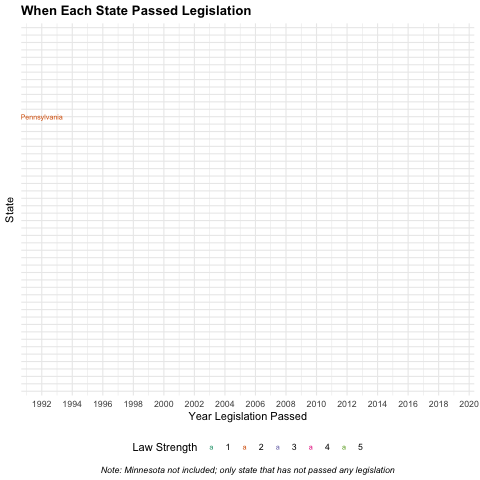

```{r libraries, warning=FALSE, message=FALSE}
library(gganimate)
library(ggmap)
library(ggridges)
library(ggthemes)
library(knitr)
library(leaflet)
library(lubridate)
library(plotly)
library(scales)
library(tidyverse)
library(tibble)
library(skimr)
library(naniar)
library(gridExtra)
library(sf)
library(htmltools)
```

```{r setup, echo=FALSE}
knitr::opts_chunk$set(results = "hold", fig.show = "hold", fig.align = "center", warning = FALSE, message = FALSE, dpi = 200)
```


# Introduction

* Info on motivation for looking into this data set
* explain where data came from
* outline research question

## Codebook

Variable                    Meaning
--------------------------  --------
`state`                     identifying variable/cases
`pop`                       size of population
`lgl_abortion_clinics`      Number of legal abortion clinics available to women in the state
`health_clinics`            women's health clinics that do not provide abortion services
`prop_abortion`             the ratio of people per abortion clinic in the state (bigger numbers mean presumably less access)
`prop_health`               the ratio of people per women's health clinic in the state (bigger numbers mean presumably less access)
`paid_fam_leave`            whether a state has a law requiring an employer to issue paid family leave (women are disproportionately affected by paid family leave or lack thereof because they're the ones having babies!)
`prop_equal_pay`            how many cents women make to the dollar that men make in each state
`equal_pay_rank`            how a state ranks nationally according to equal pay laws
`marital_rape_except`       whether a state has loopholes in sexual assault in the cases of marriage
`law strength`              metric to assign to the strength of the legislation: 5 = clear and convincing, 4 = beyond reasonable doubt, 3 = not specified, 2 = conviction, 1 = nothing				
`year_passage`              when the bill (to terminate parental rights in cases of rape that resulted in child's conception) was initially passed
`year_amend`                when/if the bill was amended to expand restrictions from requiring a rape conviction to clear and convincing evidence
`post_2015`                 whether the bill was passed before or after 2015, when the Obama Administration issued grant money to any state that made this issue a legislative priority
`bill_name`                 name of legaislation passed in the state
`perc_women`                percent of women in both chambers combined at the times of the bill's passage 
`perc_demo_senate`	        percent of members in the state senate that are of the Democratic party at the time of the bill's passage
`perc_demo_house`	          percent of members in the state house that are of the Democratic party at the time of the bill's passage
`Senate`	                  party that controlled state senate during the passage of the legislation; D = Democrat, R = Republican, P = Split, B = Bipartisan, N/A = Does not apply (legislation not passed)
`House`	                    party that controlled state house during the passage of the legislation
`Governor`                  governor's party affiliation

```{r, warning=FALSE, message=FALSE}
data <- read_csv("Honors_stats_updated_nov18_2.csv")
data <- data %>%
  select(-X22)

data
```


# Preliminary Analysis: Clustering

To begin answering our research question, we first were interested in understanding how states are similar in their state legislatures and other variables that may account for how they enact the legislation we are interested in looking at. As such, we use hierarchical clustering analysis to find structure in our data and determine states that are similar with regards to the features outlined above. Our research question focuses on understanding factors that may influence how this legislation is enforced; as a result, we do not factor in the actual strength of the law we coded above or the year in which it was passed. This is because we are interested in seeing if the variables in this data set have a relationship with what the strength of the legislation actually is.

For this analysis, we have to convert the variables that are factors into numeric data. As such, this is how the variables were coded:

* `Senate`, `House` & `Governor` variables: 1 = Bipartisan (B), 2 = Democratic (D), 3 = Purple (P), 4 = Legislation not passed (N/A), 5 = Republican (R)

* `paid_fam_leave` & `marital_rape_except` variables: 1 = "No", 2 = "Yes"

Additionally, it is also important to note why we also excluded the variables that indicate population of the state, number of legal abortion clinics available to women in the state and the number of women's health clinics in the state. We did not want to size of the state to affect the results of the clustering analysis. So to account for this, we left the variables of `prop_abortion` and `prop_health` in the algorithm because this places all states on the same scale by computing the ratio of people per abortion clinic and people to health clinics, respectively. These are the most important variables since we are trying to find similarities in resources available, and not simply the size of the state, for example.

Coding the variables above as such will allow us to see the break down of these variables when summarizing variable means across clusters once clusters have been determined. We used the complete linkage approach to find similarities between clusters of states, which is defined as the maximum distance between any 2 cases between any 2 clusters. After running the hierarchical clustering algorithm and visualizing the resultant dendrogram (i.e. when clusters merge and which states merge into what clusters), we determined that the appropriate number of natural clusters was 4 and better visualized these four clusters on a states map, as seen below.

```{r}
# Intitial clustering w/o taking into account year passage
my_cluster_data <- data %>% 
  select(-c(bill_name, year_amend, post_2015, law_strength, year_passage, Pop, lgl_abortion_clinics, health_clinics))  %>%
  mutate(Senate = as.numeric(factor(Senate)),
         House = as.numeric(factor(House)),
         Governor = as.numeric(factor(Governor)),
         paid_fam_leave = as.numeric(factor(paid_fam_leave)),
         marital_rape_except = as.numeric(factor(marital_rape_except))) %>%
  column_to_rownames("State")

# Hierarchical clustering
# method can be "complete", "single", "average", "centroid"
hier_model <- hclust(dist(scale(my_cluster_data)), method = "complete")

# Visualization: dendrogram
plot(hier_model, cex = 0.8, xlab = "", main = "Dendrogram Not Accounting for Law Strength", 
     sub = "Method: Complete Linkage")

# Assign each sample case to a cluster
# You specify the number of clusters, k
clusters <- as.factor(cutree(hier_model, k = 3))
```


```{r cluster_no_law}
# Mapping initial clustering results
states_map <- map_data("state")

data %>% 
  mutate(cluster = clusters,
         State = tolower(State)) %>%
  ggplot(aes(fill = cluster)) +
  geom_map(aes(map_id = State), color = "black", size = 0.1, alpha = 0.8, map = states_map) +
  expand_limits(x = states_map$long, y = states_map$lat) +
  theme_map() +
  scale_fill_viridis_d() +
  labs(fill = "Cluster", title = "How Each State Clusters Together, Part 1", 
       subtitle = "Results from Hierarchical Analysis before accounting for law strength",
       caption = "Note: Alaska is in Cluster 1, Hawaii is in Cluster 2") + 
  theme(plot.title = element_text(face = "bold", size = 12),
        plot.caption = element_text(face = "italic", hjust = 0.5, size = 10))

# Calculating the mean of each feature for each cluster when there are 2 clusters
my_cluster_data %>%
  mutate(cluster = clusters) %>% group_by(cluster) %>%
  summarize_all(list(mean = mean), na.rm = TRUE)
```

From this map, we are able to visualize the which states are similar in terms of their representation in the state legislatures and the resources available in each state that may affect how legislation is enforced. We can define the four clusters seen above as the following, based on the means for each variable within each cluster:

**Analysis: From this clustering, we see that states on the west coast and in the northeast, and states in the southeast and midwesttend to cluster together with respect to partisanship and favorability to women. Some notable outliers that are scattered across the country and clustered together are New Mexico, Louisiana, Missouri, Nebraska, Kentucky, West Virginia, and New Hampshire.**


From this clustering, we can see that the lowest proportion of states have split representation in the legislature and the worst representation and favorability to women. The highest proportion of states in this clustering are those whose representation is republican favored and has the second to worst representation of women. 

* **Cluster 1**: States whose representation in the state legislature is Republican favored and has the second to worst representation of women. It is a tier below Cluster 2 and a tier higher than Cluster 3 in terms of "equality" for women.

* **Cluster 2**: States whose representation in the state legislature is strongly Democratic favored and has the highest representation of women. These states also have the most "equality" for women, most access to abortion and health clinics. (Best in regards to our research question).

* **Cluster 3**: States whose representation in the state legislature is for the most part split, with representation of women the lowest out of the three clusters and the worst in terms of "equality" for women. (Worst in regards to our research question).

Taking into account the metric above in our cluster analysis, we want to compare how each state *actually* rules on this legislation to how they seem that they would on paper based on the variables above. As such, we created another map that shows the law strength for each state, with 1 being the "worst" (i.e.nothing in place) and 5 being the best (i.e. clear and convincing).

```{r map_of_law}
# Mapping states and law strength
data %>%
  mutate(State = tolower(State)) %>%
  ggplot(aes(fill = factor(law_strength))) +
  geom_map(aes(map_id = State), color = "black", size = 0.1, alpha = 0.8, map = states_map) +
  expand_limits(x = states_map$long, y = states_map$lat) +
  theme_map() +
  scale_fill_viridis_d() +
  labs(fill = "Law Strength", title = "Law Strength for Each State", 
       subtitle = "How States Actually Treat Legislation",
       caption = "Note: Alaska is 3, Hawaii is 5") + 
  theme(plot.title = element_text(face = "bold", size = 12),
        plot.caption = element_text(face = "italic", hjust = 0.5, size = 10))
```

Comparing the two maps above, we find some surprising results. For example, the group of West Coast and some East Coast states that were coded as being in Cluster 2 - the cluster that we may expect as yielding a result most progressive and favorable to women- only have a strength of 2 (requiring a rape conviction) for the legislation they have in place. Conversely, we see that states such as Florida, Mississippi and Georgia who were placed in Cluster 1 or Cluster 2 - the worst clusters - have much stronger legislation (requiring only clear and convincing evidence for termination). 

There are many possible explanations for this effect. One of them may be that those states in which have lower "equality" for women may need to have stronger laws in place to protect them because of their need to "make-up" for their treatment towards women. Another perhaps more plausible explanation is that our predictors, though indicative of mobilization for most legislative outcomes on other issues surrounding favorability to women, are insufficient. In other words, there is some other unexamined predictor that regardless of partisanship or ideology is moving states in one direction or another. We continue to analyze this issue in the section below.


Bringing it all together and now accounting for the year in which the legislation in question was passed and the strength of the law, we re-run our clustering algorithm to see how states are similar to each other in a more hollistic view, accounting for both what we expected their attitudes towards this legislation to be and the reality for the legislation in these states. Again, we determined their to be 3 "natural" clusters and visualized these groups on the map once again.

```{r}
# Hierarchical Analysis using all information
my_cluster_data2 <- data %>% 
  select(-c(bill_name, year_amend, Pop, lgl_abortion_clinics, health_clinics))  %>%
  mutate(Senate = as.numeric(factor(Senate)),
         House = as.numeric(factor(House)),
         Governor = as.numeric(factor(Governor)),
         post_2015 = as.numeric(factor(post_2015)),
         paid_fam_leave = as.numeric(factor(paid_fam_leave)),
         marital_rape_except = as.numeric(factor(marital_rape_except))) %>%
  column_to_rownames("State")

# Hierarchical clustering
# method can be "complete", "single", "average", "centroid"
hier_model2 <- hclust(dist(scale(my_cluster_data2)), method = "complete")

# Visualization: dendrogram
plot(hier_model2, cex = 0.8, xlab = "", main = " Dendrogram Accounting for Law Strength", 
     sub = "Method: Complete Linkage")

# Assign each sample case to a cluster
# You specify the number of clusters, k
clusters2 <- as.factor(cutree(hier_model2, k = 3))
```

```{r cluster_map_law}
# Calculating the mean of each feature for each cluster when there are 3 clusters
my_cluster_data2 %>%
  mutate(cluster = clusters2) %>% group_by(cluster) %>%
  summarize_all(list(mean = mean), na.rm = TRUE)

# Mapping Clusters when accounting for law strength and year passage
data %>% 
  mutate(cluster = clusters2,
         State = tolower(State)) %>%
  ggplot(aes(fill = cluster)) +
  geom_map(aes(map_id = State), color = "black", size = 0.1, alpha = 0.8, map = states_map) +
  expand_limits(x = states_map$long, y = states_map$lat) +
  theme_map() +
  scale_fill_viridis_d() +
  labs(fill = "Cluster", title = "How Each State Clusters Together, Part 2", 
       subtitle = "Accounting for Law Strength in Hierarchical Analysis",
       caption = "Note: Alaska is in Cluster 1, Hawaii is in Cluster 3") + 
  theme(plot.title = element_text(face = "bold", size = 12),
        plot.caption = element_text(face = "italic", hjust = 0.5, size = 10))
```

The breakdown in groups is very similar to the original clustering analysis, but assigned to different clusters:

* **Cluster 1**: States whose representation in the state legislature is Republican favored and has "medium" representation of women. It is a tier below Cluster 3 and a tier higher than Cluster 3 in terms of "equality" for women and has the strongest average law strength. We can see from the map that these states are scattered across the US, with concentrations in the southeast and midwest. 

* **Cluster 2**: States whose representation in the state legislature is about split and has the worst resources, "equality" and representation for women, with an average law strength of 2. These states are spread throughout the lower middle and lower east of the country. 

* **Cluster 3**: States whose representation in the state legislature is strongly favored towards Democratic and the most representation of women. These states have the most resources for women and the best "equality", with an average law strength of about 3. These states are mainly concentrated on the west coast and northeast


# Other visualizations/wrangling we will organize

The following updates our original data and adds a new column to designate if a state was red or blue at the time.

```{r}
data <- data %>%
  mutate(party = case_when(perc_demo_senate < 50 & perc_demo_house < 50 ~ "Red",
                           perc_demo_senate > 50 & perc_demo_house > 50 ~ "Blue",
                           perc_demo_senate == 50 & perc_demo_house == 50 ~ "Purple",
                           perc_demo_senate <= 50 & perc_demo_house >= 50 ~ "Purple",
                           perc_demo_senate >= 50 & perc_demo_house <= 50 ~ "Purple")) #what do we do with the Bipartisan (B) groups?
```


The following shows the breakdown of how many states have each of the five law strengths, as well as a table showing the states and their strength law and the color of the state at the time of passage.

```{r}
data %>%
  group_by(law_strength) %>%
  count() %>%
  rename("Law Strength" = "law_strength", "Number of States" = "n")

data %>%
  select(State, law_strength, party) %>%
  rename("Law Strength" = "law_strength", "Color of State During Passage of Law" = "party")
```

This map summarizes the information found in the table for each state. It is interactive so if you click on the state, a box will pop up with all of its information.

```{r, warning=FALSE, message=FALSE, dpi = 150}
# Loading shape file for all states 
shp <- read_sf("files/tl_2017_us_state/tl_2017_us_state.shp")

# Removing territories and arranging in alphabetical order
shp <- shp %>%
  filter(!NAME %in% c("Puerto Rico", "Guam", "Commonwealth of the Northern Mariana Islands", "United States Virgin Islands", "American Samoa", "District of Columbia")) %>%
  arrange(NAME)

# Creating info that will pop up when clicked on state
state_popup <- paste0("<strong>State: </strong>", data$State,
                     "<br><strong>Pop:</strong> ", data$Pop,
                     "<br><strong>Prop. Abortion Clinics: </strong> ", data$prop_health,
                     "<br><strong>Prop. Health Clinics: </strong>", data$prop_abortion,
                     "<br><strong>Family Leave: </strong>", data$paid_fam_leave,
                     "<br><strong>Prop. Equal Pay: </strong>", data$prop_equal_pay,
                     "<br><strong>Equal Pay Rank: </strong>", data$equal_pay_rank,
                     "<br><strong>Marital Exception: </strong>", data$marital_rape_except,
                     "<br><strong>Year Law Passed: </strong>", data$year_passage,
                     "<br><strong>Year Amended: </strong>",  data$year_amend,
                     "<br><strong>Controlling Party During Passage: </strong>", data$party)

# Creating Palette for Law Strength for each state
pal <- colorFactor("viridis", 
                     domain = factor(data$law_strength))
# Map
leaflet(shp) %>%
  addTiles() %>%
  setView(lng = -98.268082, lat = 41.125370, zoom = 3) %>%
  addPolygons(popup = state_popup, fillColor = ~pal(factor(data$law_strength)),
              stroke = 0.2, color = ~pal(factor(data$law_strength)), fillOpacity = 0.7, 
              smoothFactor = 0.5, 
              highlight = highlightOptions(weight = 5, 
                                 color = "black",
                                 fillOpacity = 0.9,
                                 bringToFront = FALSE)) %>%
  addLegend(pal = pal, 
            values = ~factor(data$law_strength), 
            opacity = 0.5, 
            title = "Law Strength",
            position = "bottomright")
```

Comparing three states with different levels of partisanship:

```{r}
data %>%
  mutate_all(as.character) %>%
  filter(State %in% c("Nebraska", "California", "Alabama")) %>%
  pivot_longer(-State, names_to = "Metrics", values_to = "Values") %>%
  pivot_wider(names_from = State, values_from = Values)
```

**Analysis: It is interesting to note in this table that though these states vary significantly in terms of favorability to women, ideology, and party in power, they all have legislation that requires a rape conviction. These results as outlined above could perhaps indicate the presence of a predictor variable we cannot account for--the presence or absence of a focusing event.**


```{r law_str_2015}
data %>%
  filter(post_2015 == "Yes") %>%
  group_by(factor(law_strength)) %>%
  count() %>%
  ungroup() %>%
  mutate(prop = n/sum(n)) %>%
  rename(`Law Strength` = "factor(law_strength)", `Number of States` = "n",
         `Proportion (Laws Passed after 2015)` = "prop")

data %>%
  filter(post_2015 == "Yes") %>%
  ggplot(aes(x = factor(law_strength))) +
  geom_bar(fill = "black") +
  theme_minimal() +
  theme(plot.title = element_text(face = "bold")) +
  labs(x = "Law Strength", y = "Number of States", title = "Law Strength",
       subtitle = "For States that Passed Legislation after 2015")
```

**Analysis: Of the 23 states (nearly half) that passed legislation after 2015, 17 (73.9%) of them do not require a rape conviction for termination of parental rights, and 13 (56.5%) require only clear and convincing evidence to terminate parental rights of rapists.**

```{r law_str5_2015}
data %>%
  filter(law_strength == 5) %>%
  group_by(post_2015) %>%
  count() %>%
  ggplot(aes(x = post_2015, y = n)) +
  geom_col(fill = "black") +
  theme_minimal() +
  theme(plot.title = element_text(face = "bold")) +
  labs(x = "Did the State pass legislation after 2015?", y = "Number of States",
       title = "States that passed legislation after 2015", 
       subtitle = "For States with Law Strength of 5")
```

**Analysis: This vizualisation clearly lays out that the addition of clear and convincing evidence for this legislation is fairly recent, with a couple of notable outliers.**

```{r clr_convinc_party}
data %>%
  filter(law_strength == 5) %>%
  group_by(party) %>%
  count() %>%
  ungroup() %>%
  mutate(`Percentage` = n/sum(n)) %>%
  rename(`Number of States with Clear and Convincing Standard` = "n", 
         "Party Affiliation of State during Passage of Law" = "party")
  
data %>%
  filter(law_strength == 5) %>%
  group_by(party) %>%
  count() %>%
  ungroup() %>%
  mutate(`Percentage` = n/sum(n)) %>%
  rename(`Number of States with Clear and Convincing Standard` = "n", 
         "Party Affiliation of State during Passage of Law" = "party") %>%
  ggplot(aes(x = `Party Affiliation of State during Passage of Law`,
             y = `Number of States with Clear and Convincing Standard`)) +
  geom_col(aes(fill = `Party Affiliation of State during Passage of Law`)) +
  labs(title = "States with Clear and Convincing Standard", subtitle = "(Law Strength of 5)") +
  theme_minimal() + 
  theme(legend.position = "none",
        plot.title = element_text(face = "bold")) +
  scale_fill_manual(values = c("blue", "purple", "red", "gray"))
```

**Analysis: 6 (40%) “blue” (majority democratic legislators in the state legislature), 2 (13.3%) “purple” (split between democratic and republican legislators in the state legislature) and 7 (46.6%) “red” (majority republican legislators in the state legislature) states use the clear and convincing standard. There seems to be no significant variation along party lines with regard to a higher burden of proof.**

```{r rape_conv_party}
data %>%
  filter(law_strength == 2) %>%
  group_by(party) %>%
  count() %>%
  ungroup() %>%
  mutate(`Percentage` = n/sum(n)) %>%
  rename(`Number of States Requiring Rape Conviction` = "n", 
         "Party Affiliation of State during Passage of Law" = "party")
  
data %>%
  filter(law_strength == 2) %>%
  group_by(party) %>%
  count() %>%
  ungroup() %>%
  mutate(`Percentage` = n/sum(n)) %>%
  rename(`Number of States Requiring Rape Conviction` = "n", 
         "Party Affiliation of State during Passage of Law" = "party") %>%
  ggplot(aes(x = `Party Affiliation of State during Passage of Law`,
             y = `Number of States Requiring Rape Conviction`)) +
  geom_col(aes(fill = `Party Affiliation of State during Passage of Law`)) +
  labs(title = "States that Require Rape Conviction", subtitle = "(Law Strength of 2)") +
  theme_minimal() + 
  theme(legend.position = "none",
        plot.title = element_text(face = "bold")) +
  scale_fill_manual(values = c("blue", "purple", "red", "gray"))
```

**Analysis: From this vizualisation, we may be inclined to infer that republican states by and large were the ones passing legislation requiring a rape conviction. However, this analysis would be selective, given we are missing some critical information here. In later vizualisations, we'll see how, although republican states do favor a conviction requirement, they have also passed more legislation for this issue across the board.**

```{r}
data %>%
  filter(law_strength %in% c(2, 5)) %>%
  group_by(party, law_strength) %>%
  count() %>% 
  ungroup() %>%
  group_by(law_strength) %>%
  mutate(`Percentage` = n/sum(n)) %>%
  rename(`Number of States with Law Strength` = "n", 
         "Party Affiliation of State during Passage of Law" = "party")

data %>%
  filter(law_strength %in% c(2, 5)) %>%
  group_by(party, law_strength) %>%
  count() %>% 
  ungroup() %>%
  group_by(law_strength) %>%
  mutate(`Percentage` = n/sum(n)) %>%
  rename(`Number of States with Law Strength` = "n", 
         "Party Affiliation of State during Passage of Law" = "party") %>%
  ggplot(aes(x = `Party Affiliation of State during Passage of Law`, 
             y = `Number of States with Law Strength`)) +
  geom_col(aes(fill = factor(law_strength)), position = position_dodge())+
  theme_minimal() +
  theme(plot.title = element_text(face = "bold")) +
  labs(y = "Number of States", 
       title = "Party Affiliation for States with Law Strength 2 and 5", 
       fill = "Law Strength") +
  scale_fill_brewer(palette = 7)
```

**Analysis: 24 states currently require a rape conviction for TPR. Of those states, 6 (25%) were “blue”, 12 (50%) were “red”, and 5 (20.83%) were “purple” at the time of passage. 15 states currently use the clear and convincing standard, 6 (40%) are "blue", 2 (13.3%) are "purple", and 7 (46.7%) are "red." From this vizualization, we can glean several things. Firstly, there seems to be no disernible difference for democratic leaning states in terms of whether they pass this legislation requiring a rape conviction or clear and convincing evidence, whereas among republican or "red" states, there is a much higher tendency to pass legislation requiring a rape conviction than clear and convincing evidence as a standard. Secondly, across the board, the majority of states passing legislation are republican favored. Thirdly, the ratio of partisan states requiring a rape conviction (6:12) is much more pronounced than the ratio of partisan states requiring clear and convincing evidence (6:7).**

This plot is a combination of the previous 3. It shows the # of states for each law strength, broken up by party.

```{r}
data %>% 
  group_by(law_strength, party) %>% 
  count() %>% 
  replace_na(list(party = "N/A")) %>%
  ggplot(aes(x = law_strength, y = n)) +
  geom_col(aes(fill = party), position = position_dodge()) +
  scale_fill_manual(values = c("blue", "gray", "purple", "red")) + #why does this get rid of NA? Should be an NA in strength 1 and strength 2. 
  theme_minimal() +
  labs(x = "Strength of Law", y = "Number of States", title = "Law Strength by Number of States and Party", fill = "Party")
```


**Analysis: 16 states who passed legislation to terminate the parental rights of rapists had Democratically controlled legislatures at the time of passage, 7 were split, and 25 were republican-controlled. The NA shows information on Nebraska, which has a Bipartisan legislature and is therefore not applicable in this analysis. Minnesota is excluded as well because the state currently has nothing in place.**

```{r}
data %>%
  filter(law_strength != 1) %>%
  group_by(party) %>%
  count() %>% 
  ungroup() %>%
  mutate(`Percentage` = n/sum(n)) %>%
  rename(`Number of States` = "n", "Color of State during Passage of Law" = "party")

data %>%
  filter(law_strength != 1) %>%
  group_by(party) %>%
  count() %>% 
  ungroup() %>%
  mutate(`Percentage` = n/sum(n)) %>%
  rename(`Number of States` = "n", "Color of State during Passage of Law" = "party") %>%
  ggplot(aes(x = `Color of State during Passage of Law`, y = `Number of States`)) +
  geom_col(aes(fill = `Color of State during Passage of Law`)) +
  labs(title = "States that passed legislation to terminate the parental rights of rapists") +
  theme_minimal() +
  theme(legend.position = "none", plot.title = element_text(face = "bold")) +
  scale_fill_manual(values = c("blue", "purple", "red", "gray"))
```


```{r}
data %>%
  ggplot(aes(x = year_passage)) +
  geom_density() +
  theme_minimal() +
  theme(plot.title = element_text(face = "bold")) +
  labs(x = "Year Legislation Passed", y = "Density", 
       title = "Distribution of Years in which States passed Legislation")
```

**Analysis: This vizualisation shows us that the overwhelming majority of states passed legislation after 2010. This dramatic accelerated response perhaps indicates the presence of one or multiple "focusing events." Aptly named, focusing events refer to nationwide, regional, or local stories or movements that spur action on previously dormant issues. In our case, several CNN stories over the 10 year span (2012, 2015, 2017) may have reached interest groups, legislators, and/or constituents who were eager to move this legislation up on the agenda, or at least to amend it to be stronger. Additionally, on April 24, 2015, the US Senate voted to push states to restrict the rights of rapists to claim custody over the children conceived as a result of the rape. The Rape Survivor Child Custody Act, originally introduced by Sens. Sherrod Brown (D-OH) and Kelly Ayotte (R-NH), provided an incentive for states in the form of grant money to pass termination of parental rights legislation. The Act passed as an amendment to the Justice for Victims of Trafficking Act of 2015, a comprehensive human trafficking bill sponsored by Sen. John Cornyn (R-TX). Though correlation does not necessarily imply causation here, we can see how either of these nationwide focusing events could have provided the necessary push for states without legislation previously.**


```{r}
data %>%
  arrange(year_passage) %>%
  ggplot(aes(y = State, x = year_passage, label = State, color = factor(law_strength))) +
  geom_text(size = 2.5) +
  theme_minimal() +
  labs(x = "Year Legislation Passed", color = "Law Strength", 
       title = "When Each State Passed Legislation", 
       caption = "Note: Minnesota not included; only state that has not passed any legislation") +
  theme(axis.text.y = element_blank(),
        legend.position = "bottom",
        plot.title = element_text(face = "bold"), 
        plot.caption = element_text(face = "italic", hjust = 0.5)) +
  scale_x_continuous(breaks = seq(1990, 2020, 2)) +
  scale_color_viridis_d() 
```

```{r echo=FALSE, fig.align='center', dpi=600}

```

**Analysis: Here, we can more closely see the proportion of states that passed legislation each year after 2010. As indicated with our theory of focusing events in the previous analysis, the years with the largest amount of legislature mobilization are those in or following 2015. 2013 also stands out as a year in which many states moved to pass or amend the legislation, which again, could point to the CNN's story's impact. It is interesting to note, as we saw in a previous visualization, that of the majority of states who have passed legislation in the last decade, many have opted for clear and convincing evidence as the standard, while prior to 2010, only one state (Connecticutt) passed legislation with the lowest burden of proof in criminal court. With percentages, we can see this idea even more clearly: There are only 15 states that use “clear and convincing evidence” as a burden of proof for terminating parental rights of rapists, and 13 of those states (86.6%) passed legislation AFTER 2015.**

prop of abortion clincs vs law str (not raw#)
```{r}
data %>% 

  ggplot(aes(x = prop_abortion, group = law_strength)) +
  geom_density(aes(fill = factor(law_strength)), alpha = 0.7)  +
  theme_minimal() +
  scale_fill_viridis_d() 
```

**Analysis: This plot shows that states with the strongest legislation (lowest burden of proof) have, for the most part, the most favorable proportion of population to abortion clinics. Similarly, the states with the weakest legislation (highest burden of proof, requiring a rape conviction) have the worst proportion of population to abortion clinics. These results point to an interesting hypocricy in ideological incentivizing across states. We might expect that states with very few abortion clinics (an indication of a very pro-life ideological base) would have greater law strength to incentivize women to have their babies, or to make sure that women who had already borne children instead of aborting were protected against having to coparent with their assailants. On the converse side of the equation, states with more abortion clinics per person have greater law strength, which indicates a higher favorabiity to women regarding pro-choice. Whether women who have rape induced pregnancies keep or abort their babies, they have options. Interestingly, when we turn to the health clinic vizualisation, we see that these sharp divides are largely nonexistent. Regardless of law strength, states seem to have pretty decent proportions of women's health clinics per population, an indication of non-controversy.**

# References

https://catalog.data.gov/dataset/tiger-line-shapefile-2017-nation-u-s-current-state-and-equivalent-national
https://www.worldatlas.com/articles/us-states-by-population.html
https://state.1keydata.com/state-population-density.php
https://www.refinery29.com/en-us/2019/01/217375/abortion-clinics-laws-map
https://lozierinstitute.org/health-clinics-nationwide-compared-to-planned-parenthood-centers/
https://www.patriotsoftware.com/payroll/training/blog/states-with-paid-family-leave/
http://www.ncsl.org/research/labor-and-employment/paid-family-leave-in-the-states.aspx
https://www.aauw.org/resource/gender-pay-gap-by-state-and-congressional-district/
https://www.vocativ.com/215942/these-13-states-still-make-exceptions-for-marital-rape/index.html
https://www.prochoiceamerica.org/state
https://www.cawp.rutgers.edu/state_fact_sheets/al
https://www.congress.gov/bill/114th-congress/house-bill/1257
