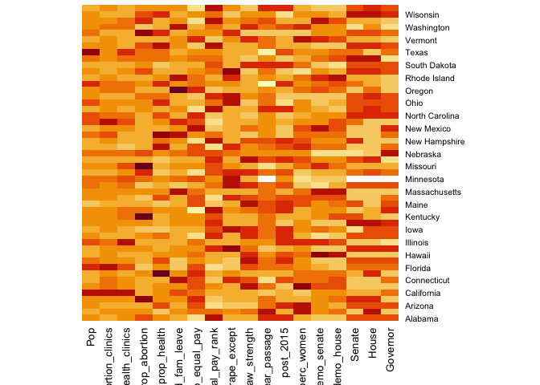
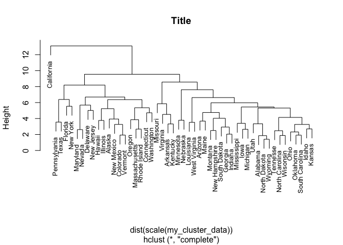

```r
library(gganimate)
library(ggmap)
library(ggridges)
library(ggthemes)
library(knitr)
library(leaflet)
library(lubridate)
library(plotly)
library(scales)
library(tidyverse)
library(tibble)
library(skimr)
library(naniar)
```


# Introduction

* Info on motivation for looking into this data set
* explain where data came from
* outline research question

## Codebook

Variable                    Meaning
--------------------------  --------
`state`                     identifying variable
`pop`                       size of population
`lgl_abortion_clinics`      Number of legal abortion clinics available to women in the state
`health_clinics`            women's health clinics that do not provide abortion services
`prop_abortion`             the ratio of people per abortion clinic in the state (bigger numbers mean presumably less access)
`prop_health`               the ratio of people per women's health clinic in the state (bigger numbers mean presumably less access)
`paid_fam_leave`            whether a state has a law requiring an employer to issue paid family leave (women are disproportionately affected by paid family leave or lack thereof because they're the ones having babies!)
`prop_equal_pay`            how many cents women make to the dollar that men make in each state
`equal_pay_rank`            how a state ranks nationally according to equal pay laws
`marital_rape_except`       whether a state has loopholes in sexual assault in the cases of marriage
`law strength`              metric to assign to the strength of the legislation: 5 = clear and convincing, 4 = beyond reasonable doubt, 3 = not specified, 2 = conviction, 1 = nothing				
`year_passage`              when the bill (to terminate parental rights in cases of rape that resulted in child's conception) was initially passed
`year_amend`                when/if the bill was amended to expand restrictions from requiring a rape conviction to clear and convincing evidence
`post_2015`                 whether the bill was passed before or after 2015, when the Obama Administration issued grant money to any state that made this issue a legislative priority
`bill_name`                 name of legaislation passed in the state
`perc_women`                percent of women 
`perc_demo_senate`	        percent of members in the state senate that are of the Democratic party
`perc_demo_house`	          percent of members in the state house that are of the Democratic party
`Senate`	                  party that controlled state senate during the passage of the legislation;
D = Democrat, R = Republican, P = Split, B = Bipartisan, N/A = Does not apply (legislation not passed)
`House`	                    party that controlled state house during the passage of the legislation
`Governor`                  governor's party affiliation


```r
data <- read_csv("Honors_stats_updated_nov17_2.csv")
data
```

```
## # A tibble: 50 x 22
##    State    Pop lgl_abortion_cl… health_clinics prop_abortion prop_health
##    <chr>  <dbl>            <dbl>          <dbl>         <dbl>       <dbl>
##  1 Alab… 4.87e6                3            234      1624916       20832 
##  2 Alas… 7.38e5                3            165       246144        4475.
##  3 Ariz… 6.83e6                9            183       758674       37312 
##  4 Arka… 2.98e6                1            179      2978204       16638 
##  5 Cali… 3.95e7              152           1694       260110.      23339.
##  6 Colo… 5.46e6               21            243       259837.      22455.
##  7 Conn… 3.59e6               25            231       143635.      15545.
##  8 Dela… 9.46e5                3             13       315311.      72764.
##  9 Flor… 2.03e7               71            636       285511.      31873.
## 10 Geor… 1.02e7               17            274       600874.      37281.
## # … with 40 more rows, and 16 more variables: paid_fam_leave <chr>,
## #   prop_equal_pay <dbl>, equal_pay_rank <dbl>, marital_rape_except <chr>,
## #   law_strength <dbl>, year_passage <dbl>, year_amend <dbl>,
## #   post_2015 <chr>, bill_name <chr>, perc_women <dbl>,
## #   perc_demo_senate <dbl>, perc_demo_house <dbl>, Senate <chr>,
## #   House <chr>, Governor <chr>, X22 <chr>
```


# Preliminary Analysis: Clustering


```r
# NOTE: ask Emma about funkiness of CA variables
# NOTE: fair to say the MN is "no" for post_2015 (at least for this analysis)

my_cluster_data <- data %>% 
  select(-c(X22, bill_name, year_amend)) %>%
  replace_na(replace = list(perc_women = 0, post_2015 = "No")) %>%
  mutate(post_2015 = fct_collapse(post_2015, Yes = c("yes", "Yes"))) %>%
  mutate(Senate = as.numeric(factor(Senate)),
         House = as.numeric(factor(House)),
         paid_fam_leave = as.numeric(factor(paid_fam_leave)),
         post_2015 = as.numeric(factor(post_2015)),
         Governor = as.numeric(factor(Governor)),
         marital_rape_except = as.numeric(factor(marital_rape_except))) %>%
  column_to_rownames("State")

my_cluster_data

# Hierarchical clustering
# method can be "complete", "single", "average", "centroid"
hier_model <- hclust(dist(scale(my_cluster_data)), method = "complete")


# Visualization: heatmaps (w/ and w/out dendrogram)
heatmap(data.matrix(scale(my_cluster_data)), Colv = NA)
heatmap(data.matrix(scale(my_cluster_data)), Colv = NA, Rowv = NA)


# Visualization: dendrogram (change font size w/ cex)
plot(hier_model, cex = 0.8, main = "Title")


# Assign each sample case to a cluster (you can add to dataset using mutate())
# You specify the number of clusters, k
clusters <- as.factor(cutree(hier_model, k = 5))
```

```
##                     Pop lgl_abortion_clinics health_clinics prop_abortion
## Alabama         4874747                    3            234     1624916.0
## Alaska           738432                    3            165      246144.0
## Arizona         6828065                    9            183      758674.0
## Arkansas        2978204                    1            179     2978204.0
## California     39536653                  152           1694      260109.6
## Colorado        5456574                   21            243      259836.9
## Connecticut     3590886                   25            231      143635.4
## Delaware         945934                    3             13      315311.3
## Florida        20271272                   71            636      285510.9
## Georgia        10214860                   17            274      600874.1
## Hawaii          1427538                    4             77      356884.5
## Idaho           1654930                    3            129      551643.3
## Illinois       12859995                   24            670      535833.1
## Indiana         6619680                    9            216      735520.0
## Iowa            3123899                   12            213      260324.9
## Kansas          2911641                    4            223      727910.2
## Kentucky        4454189                    1            358     4454189.0
## Louisiana       4670724                    5            294      934144.8
## Maine           1329328                    4            172      332332.0
## Maryland        6052177                   25            132      242087.1
## Massachusetts   6859819                   10            270      685981.9
## Michigan        9962311                   20            421      498115.5
## Minnesota       5576606                    6            421      929434.3
## Mississippi     2992333                    1            377     2992333.0
## Missouri        6083672                    1            588     6083672.0
## Montana         1032949                    5            130      206589.8
## Nebraska        1920076                    3            167      640025.3
## Nevada          2890845                    8             40      361355.6
## New Hampshire   1330608                    4             52      332652.0
## New Jersey      8958013                   41            130      218488.1
## New Mexico      2085109                    9            165      231678.8
## New York       19795791                   95            625      208376.7
## North Carolina 10042802                   16            294      627675.1
## North Dakota     756927                    1             71      756927.0
## Ohio           11613423                   12            280      967785.2
## Oklahoma        3930864                    3            129     1310288.0
## Oregon          4028977                   15            273      268598.5
## Pennsylvania   12805537                   20            326      640276.9
## Rhode Island    1056298                    3             46      352099.3
## South Carolina  4896146                    3            268     1632048.7
## South Dakota     858469                    1            103      858469.0
## Tennesse        6600299                    7            267      942899.9
## Texas          27469114                   20            732     1373455.7
## Utah            2995919                    2             61     1497959.5
## Vermont          623657                    6             76      103942.8
## Virginia        8470020                    2            181     4235010.0
## Washington      7405743                   33            393      224416.5
## West Virginia   1844128                    1            317     1844128.0
## Wisonsin        5771337                    4            162     1442834.2
## Wyoming          579315                    1             33      579315.0
##                prop_health paid_fam_leave prop_equal_pay equal_pay_rank
## Alabama          20832.000              1             73             48
## Alaska            4475.345              1             80             26
## Arizona          37312.000              1             84             11
## Arkansas         16638.000              1             85              7
## California       23339.228              2             88              1
## Colorado         22455.037              1             83             20
## Connecticut      15544.961              2             84             12
## Delaware         72764.154              1             84             10
## Florida          31873.069              1             85              8
## Georgia          37280.511              1             80             24
## Hawaii           18539.455              1             83             17
## Idaho            12828.915              1             78             39
## Illinois         19194.022              1             81             22
## Indiana          30646.667              1             75             44
## Iowa             14666.192              1             78             37
## Kansas           13056.686              1             79             36
## Kentucky         12441.869              1             79             33
## Louisiana        15886.816              1             70             51
## Maine             7728.651              1             83             16
## Maryland         45849.826              1             86              4
## Massachusetts    25406.737              2             83             15
## Michigan         23663.447              1             79             34
## Minnesota        13246.095              1             83             18
## Mississippi       7937.223              1             75             43
## Missouri         10346.381              1             78             38
## Montana           7945.762              1             77             41
## Nebraska         11497.461              1             80             27
## Nevada           72271.125              1             86              5
## New Hampshire    25588.615              1             74             45
## New Jersey       68907.792              2             79             35
## New Mexico       12637.024              1             84             13
## New York         31673.266              2             88              2
## North Carolina   34159.190              1             83             14
## North Dakota     10660.944              1             73             47
## Ohio             41476.511              1             79             31
## Oklahoma         30472.000              1             76             42
## Oregon           14758.158              2             84              9
## Pennsylvania     39280.788              1             81             21
## Rhode Island     22963.000              2             83             19
## South Carolina   18269.201              1             80             29
## South Dakota      8334.650              1             78             40
## Tennesse         24720.221              1             80             25
## Texas            37526.112              1             80             23
## Utah             49113.426              1             74             46
## Vermont           8206.013              1             85              6
## Virginia         46795.691              1             79             30
## Washington       18844.130              2             79             32
## West Virginia     5817.438              1             71             49
## Wisonsin         35625.537              1             80             28
## Wyoming          17555.000              1             70             50
##                marital_rape_except law_strength year_passage post_2015
## Alabama                          1            2         2019         2
## Alaska                           1            3         2018         1
## Arizona                          1            2         2016         2
## Arkansas                         1            2         2013         1
## California                       1            2         1997         1
## Colorado                         1            5         2013         1
## Connecticut                      2            5         2001         2
## Delaware                         1            2         2007         1
## Florida                          1            5         2018         2
## Georgia                          1            5         2016         2
## Hawaii                           1            5         2013         2
## Idaho                            2            3         2005         1
## Illinois                         1            3         2013         2
## Indiana                          1            5         2016         2
## Iowa                             2            5         2016         2
## Kansas                           1            2         2012         1
## Kentucky                         1            2         2014         1
## Louisiana                        1            3         2016         2
## Maine                            1            5         2016         2
## Maryland                         2            5         2018         2
## Massachusetts                    1            2         2014         1
## Michigan                         2            5         2016         2
## Minnesota                        2            1           NA         1
## Mississippi                      2            5         2017         2
## Missouri                         1            2         1997         1
## Montana                          1            5         2017         2
## Nebraska                         1            2         2006         1
## Nevada                           2            3         2017         2
## New Hampshire                    1            4         2017         2
## New Jersey                       1            2         2013         1
## New Mexico                       1            3         2011         1
## New York                         1            2         2013         1
## North Carolina                   1            2         2012         1
## North Dakota                     1            2         2019         2
## Ohio                             2            2         2014         1
## Oklahoma                         2            3         2014         1
## Oregon                           1            2         2011         1
## Pennsylvania                     1            2         1992         2
## Rhode Island                     2            2         2013         1
## South Carolina                   2            2         2013         1
## South Dakota                     1            5         2019         2
## Tennesse                         1            2         2010         1
## Texas                            1            2         1997         2
## Utah                             1            2         2013         1
## Vermont                          1            5         2014         1
## Virginia                         2            2         2006         1
## Washington                       1            5         2017         2
## West Virginia                    1            3         2014         1
## Wisonsin                         1            3         2011         1
## Wyoming                          1            1         2019         2
##                perc_women perc_demo_senate perc_demo_house Senate House
## Alabama              15.7             22.9            26.7      4     4
## Alaska               31.7             30.0            40.0      2     4
## Arizona              35.6             43.3            40.0      4     4
## Arkansas             17.0             40.0            48.0      4     4
## California            0.0             55.0            55.0      2     2
## Colorado             41.0             54.3            55.4      2     2
## Connecticut          27.8             58.3            66.2      2     2
## Delaware             21.6             50.0            50.0      2     4
## Florida              26.3             37.5            33.3      4     4
## Georgia              24.6             30.4            33.9      4     4
## Hawaii               28.9             96.0            86.2      2     2
## Idaho                21.7             19.0            19.0      4     4
## Illinois             32.2             67.8            60.2      2     2
## Indiana              20.7             20.0            30.0      4     4
## Iowa                 22.7             52.0            43.0      2     4
## Kansas               20.9             20.0            26.4      4     4
## Kentucky             18.1             36.8            54.0      4     2
## Louisiana            15.3             35.9            40.0      2     2
## Maine                29.6             42.9            51.0      4     2
## Maryland             32.4             70.0            65.0      2     2
## Massachusetts        24.5             90.0            82.0      2     2
## Michigan             20.3             29.0            41.8      4     4
## Minnesota             0.0              0.0             0.0     NA    NA
## Mississippi          14.9             38.5            39.3      4     4
## Missouri             23.4             79.2            53.7      2     2
## Montana              28.7             36.0            41.0      4     4
## Nebraska             16.0              0.0             0.0      1     1
## Nevada               39.7             52.4            64.3      2     2
## New Hampshire        29.5             41.7            43.8      4     2
## New Jersey           29.2             60.0            60.0      2     2
## New Mexico           26.3             64.3            52.9      2     2
## New York             22.1             52.4            71.3      4     2
## North Carolina       18.5             38.0            43.3      4     4
## North Dakota         21.3             21.3            16.0      4     4
## Ohio                 23.5             30.3            39.4      4     4
## Oklahoma             13.4             25.0            28.7      4     4
## Oregon               25.6             53.3            50.0      2     3
## Pennsylvania         18.2             50.0            51.7      3     2
## Rhode Island         27.4             84.2            92.0      2     2
## South Carolina       12.9             39.1            37.1      4     4
## South Dakota         23.8             14.3            15.7      4     4
## Tennesse             17.2             42.4            47.5      4     4
## Texas                20.4             48.4            54.7      4     2
## Utah                 16.3             17.2            18.7      4     4
## Vermont              40.6             70.0            62.0      2     2
## Virginia             15.0             41.0            41.0      4     4
## Washington           36.7             51.0            51.0      2     3
## West Virginia        16.4             70.6            53.0      2     2
## Wisonsin             22.6             42.4            38.4      4     4
## Wyoming              15.6             10.0            15.0      4     4
##                Governor
## Alabama               2
## Alaska                1
## Arizona               2
## Arkansas              1
## California            2
## Colorado              1
## Connecticut           2
## Delaware              1
## Florida               2
## Georgia               2
## Hawaii                1
## Idaho                 2
## Illinois              1
## Indiana               2
## Iowa                  2
## Kansas                2
## Kentucky              1
## Louisiana             2
## Maine                 2
## Maryland              2
## Massachusetts         1
## Michigan              2
## Minnesota            NA
## Mississippi           2
## Missouri              1
## Montana               1
## Nebraska              2
## Nevada                2
## New Hampshire         1
## New Jersey            2
## New Mexico            2
## New York              1
## North Carolina        2
## North Dakota          2
## Ohio                  2
## Oklahoma              2
## Oregon                1
## Pennsylvania          1
## Rhode Island          1
## South Carolina        2
## South Dakota          2
## Tennesse              1
## Texas                 2
## Utah                  2
## Vermont               1
## Virginia              2
## Washington            1
## West Virginia         1
## Wisonsin              2
## Wyoming               2
```




```r
# Calculating the mean of each feature for each cluster when there are 2 clusters
my_cluster_data %>%
  mutate(cluster = clusters) %>% group_by(cluster) %>%
  summarize_all(list(mean = mean), na.rm = TRUE)
```

```
## # A tibble: 5 x 19
##   cluster Pop_mean lgl_abortion_cl… health_clinics_… prop_abortion_m…
##   <fct>      <dbl>            <dbl>            <dbl>            <dbl>
## 1 1         4.42e6             6                211.          945608.
## 2 2         4.33e6            15.3              195.          303086.
## 3 3         5.50e6             1.25             326.         4437769.
## 4 4         3.95e7           152               1694           260110.
## 5 5         2.01e7            51.5              580.          626905.
## # … with 14 more variables: prop_health_mean <dbl>,
## #   paid_fam_leave_mean <dbl>, prop_equal_pay_mean <dbl>,
## #   equal_pay_rank_mean <dbl>, marital_rape_except_mean <dbl>,
## #   law_strength_mean <dbl>, year_passage_mean <dbl>,
## #   post_2015_mean <dbl>, perc_women_mean <dbl>,
## #   perc_demo_senate_mean <dbl>, perc_demo_house_mean <dbl>,
## #   Senate_mean <dbl>, House_mean <dbl>, Governor_mean <dbl>
```

# Other things to keep in mind as we make visualizations

* Of the 24 states (nearly half) that passed legislation after 2015, 19 (79.2%) of them do not require a rape conviction for termination of parental rights, and 14 (58.33%) require only clear and convincing evidence to terminate parental rights of rapists.


```r
data %>%
  filter(post_2015 == "Yes") %>%
  ggplot(aes(x = factor(law_strength))) +
  geom_bar(fill = "black") +
  theme_minimal() +
  labs(x = "Law Strength", y = "Number of States")

data %>%
  filter(post_2015 == "Yes") %>%
  group_by(factor(law_strength)) %>%
  count() %>%
  ungroup() %>%
  mutate(prop = n/sum(n)) %>%
  rename(`Law Strength` = "factor(law_strength)", `Number of States` = "n",
         `Proportion (Law Passed after 2015)` = "prop")
```

```
## # A tibble: 4 x 3
##   `Law Strength` `Number of States` `Proportion (Law Passed after 2015)`
##   <fct>                       <int>                                <dbl>
## 1 1                               1                               0.0476
## 2 2                               5                               0.238 
## 3 3                               3                               0.143 
## 4 5                              12                               0.571
```

<!-- -->


* There are only 16 states that use “clear and convincing evidence” as a burden of proof for terminating parental rights of rapists, and 14 of those states (87.5%) passed legislation AFTER 2015.


```r
data %>%
  filter(law_strength == 5) %>%
  group_by(post_2015) %>%
  count() %>%
  ggplot(aes(x = post_2015, y = n)) +
  geom_col(fill = "black") +
  theme_minimal() +
  labs(x = "Did the State pass legislation after 2015?", y = "Number of States",
       title = "States that passed legislation after 2015", 
       subtitle = "For States with Law Strength of 5")
```

<!-- -->


* 6 (37.5%) “blue” (majority democratic legislators in the state legislature), 2 (12.5%) “purple” (split between democratic and republican legislators in the state legislature) and 8 (50%) “red” (majority republican legislators in the state legislature) states use the clear and convincing standard. There seems to be no significant variation along party lines with regard to a higher burden of proof.


```r
# Still working this out
data %>%
  filter(law_strength == 5) %>%
  mutate(party = case_when(Senate == "R" & House == "R" ~ "Red",
                           Senate == "D" & House == "D" ~ "Blue"))
```

* 14 states who passed legislation to terminate the parental rights of rapists had democratically controlled legislatures at the time of passage, 5 were split, and 30 were republican-controlled.

* 21 states currently require a rape conviction for TPR. Of those states, 4 (19%) were “blue”, 14 (66.67%) were “red”, and 3 (14.29%) were “purple” at the time of passage.

* This shows the distribution of years of when the legislation was passed

```r
data %>%
  ggplot(aes(x = year_passage)) +
  geom_density() +
  theme_minimal()
```

```
## Warning: Removed 1 rows containing non-finite values (stat_density).
```

<!-- -->

* This shows when each state passed the legislation, going from earliest to latest (we can make a gif out of this!!)


```r
data %>%
  arrange(year_passage) %>%
  ggplot(aes(y = State, x = year_passage, label = State, color = factor(law_strength))) +
  geom_text(size = 2.5) +
  theme_minimal() +
  labs(x = "Year Legislation Passed", color = "Law Strength") +
  theme(axis.text.y = element_blank(),
        legend.position = "bottom") +
  scale_x_continuous(breaks = seq(1992, 2020, 3))
```

```
## Warning: Removed 1 rows containing missing values (geom_text).
```

<!-- -->


