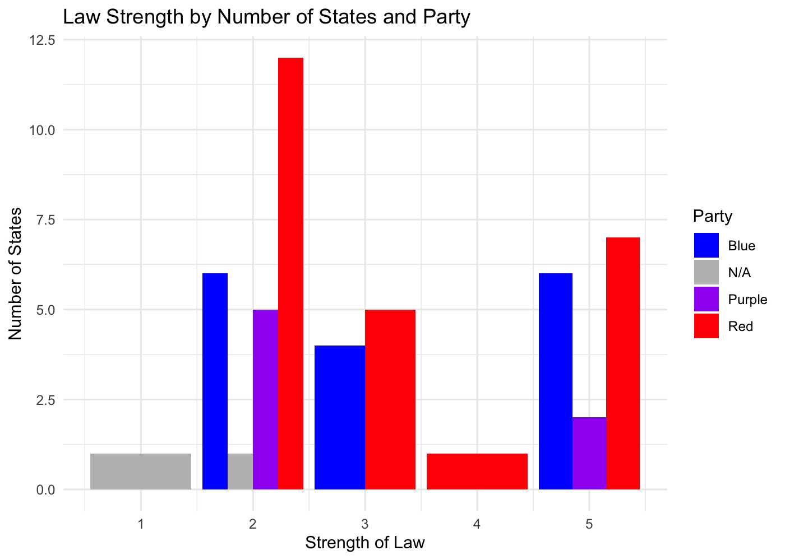

```r
library(gganimate)
library(ggmap)
library(ggridges)
library(ggthemes)
library(knitr)
library(leaflet)
library(lubridate)
library(plotly)
library(scales)
library(tidyverse)
library(tibble)
library(skimr)
library(naniar)
```


# Introduction

* Info on motivation for looking into this data set
* explain where data came from
* outline research question

## Codebook

Variable                    Meaning
--------------------------  --------
`state`                     identifying variable
`pop`                       size of population
`lgl_abortion_clinics`      Number of legal abortion clinics available to women in the state
`health_clinics`            women's health clinics that do not provide abortion services
`prop_abortion`             the ratio of people per abortion clinic in the state (bigger numbers mean presumably less access)
`prop_health`               the ratio of people per women's health clinic in the state (bigger numbers mean presumably less access)
`paid_fam_leave`            whether a state has a law requiring an employer to issue paid family leave (women are disproportionately affected by paid family leave or lack thereof because they're the ones having babies!)
`prop_equal_pay`            how many cents women make to the dollar that men make in each state
`equal_pay_rank`            how a state ranks nationally according to equal pay laws
`marital_rape_except`       whether a state has loopholes in sexual assault in the cases of marriage
`law strength`              metric to assign to the strength of the legislation: 5 = clear and convincing, 4 = beyond reasonable doubt, 3 = not specified, 2 = conviction, 1 = nothing				
`year_passage`              when the bill (to terminate parental rights in cases of rape that resulted in child's conception) was initially passed
`year_amend`                when/if the bill was amended to expand restrictions from requiring a rape conviction to clear and convincing evidence
`post_2015`                 whether the bill was passed before or after 2015, when the Obama Administration issued grant money to any state that made this issue a legislative priority
`bill_name`                 name of legaislation passed in the state
`perc_women`                percent of women 
`perc_demo_senate`	        percent of members in the state senate that are of the Democratic party
`perc_demo_house`	          percent of members in the state house that are of the Democratic party
`Senate`	                  party that controlled state senate during the passage of the legislation; D = Democrat, R = Republican, P = Split, B = Bipartisan, N/A = Does not apply (legislation not passed)
`House`	                    party that controlled state house during the passage of the legislation
`Governor`                  governor's party affiliation


```r
data <- read_csv("Honors_stats_updated_nov17_2.csv")
data <- data %>%
  mutate(post_2015 = fct_collapse(post_2015, Yes = c("yes", "Yes")),
         State = fct_recode(State, "Wisconsin" = "Wisonsin", "Tennessee" = "Tennesse"))

data
```

```
## # A tibble: 50 x 22
##    State    Pop lgl_abortion_cl… health_clinics prop_abortion prop_health
##    <fct>  <dbl>            <dbl>          <dbl>         <dbl>       <dbl>
##  1 Alab… 4.87e6                3            234      1624916       20832 
##  2 Alas… 7.38e5                3            165       246144        4475.
##  3 Ariz… 6.83e6                9            183       758674       37312 
##  4 Arka… 2.98e6                1            179      2978204       16638 
##  5 Cali… 3.95e7              152           1694       260110.      23339.
##  6 Colo… 5.46e6               21            243       259837.      22455.
##  7 Conn… 3.59e6               25            231       143635.      15545.
##  8 Dela… 9.46e5                3             13       315311.      72764.
##  9 Flor… 2.03e7               71            636       285511.      31873.
## 10 Geor… 1.02e7               17            274       600874.      37281.
## # … with 40 more rows, and 16 more variables: paid_fam_leave <chr>,
## #   prop_equal_pay <dbl>, equal_pay_rank <dbl>, marital_rape_except <chr>,
## #   law_strength <dbl>, year_passage <dbl>, year_amend <dbl>,
## #   post_2015 <fct>, bill_name <chr>, perc_women <dbl>,
## #   perc_demo_senate <dbl>, perc_demo_house <dbl>, Senate <chr>,
## #   House <chr>, Governor <chr>, X22 <chr>
```


# Preliminary Analysis: Clustering


```r
# NOTE: ask Emma about funkiness of CA variables
# NOTE: fair to say the MN is "no" for post_2015 (at least for this analysis)

my_cluster_data <- data %>% 
  select(-c(X22, bill_name, year_amend)) %>%
  replace_na(replace = list(perc_women = 0, post_2015 = "No")) %>%
  mutate(Senate = as.numeric(factor(Senate)),
         House = as.numeric(factor(House)),
         paid_fam_leave = as.numeric(factor(paid_fam_leave)),
         post_2015 = as.numeric(factor(post_2015)),
         Governor = as.numeric(factor(Governor)),
         marital_rape_except = as.numeric(factor(marital_rape_except))) %>%
  column_to_rownames("State")

# Hierarchical clustering
# method can be "complete", "single", "average", "centroid"
hier_model <- hclust(dist(scale(my_cluster_data)), method = "complete")

# Visualization: dendrogram (change font size w/ cex)
plot(hier_model, cex = 0.8, xlab = "", sub = "Method: Complete Linkage")

# Assign each sample case to a cluster (you can add to dataset using mutate())
# You specify the number of clusters, k
clusters <- as.factor(cutree(hier_model, k = 5))
```

<!-- -->


```r
# Calculating the mean of each feature for each cluster when there are 2 clusters
my_cluster_data %>%
  mutate(cluster = clusters) %>% group_by(cluster) %>%
  summarize_all(list(mean = mean), na.rm = TRUE)
```

```
## # A tibble: 5 x 19
##   cluster Pop_mean lgl_abortion_cl… health_clinics_… prop_abortion_m…
##   <fct>      <dbl>            <dbl>            <dbl>            <dbl>
## 1 1         4.42e6             6                211.          945608.
## 2 2         4.33e6            15.3              195.          303086.
## 3 3         5.50e6             1.25             326.         4437769.
## 4 4         3.95e7           152               1694           260110.
## 5 5         2.01e7            51.5              580.          626905.
## # … with 14 more variables: prop_health_mean <dbl>,
## #   paid_fam_leave_mean <dbl>, prop_equal_pay_mean <dbl>,
## #   equal_pay_rank_mean <dbl>, marital_rape_except_mean <dbl>,
## #   law_strength_mean <dbl>, year_passage_mean <dbl>,
## #   post_2015_mean <dbl>, perc_women_mean <dbl>,
## #   perc_demo_senate_mean <dbl>, perc_demo_house_mean <dbl>,
## #   Senate_mean <dbl>, House_mean <dbl>, Governor_mean <dbl>
```


```r
states_map <- map_data("state")

data %>% 
  mutate(cluster = clusters,
         State = tolower(State)) %>%
  ggplot(aes(fill = cluster)) +
  geom_map(aes(map_id = State), color = "black", size = 0.1, alpha = 0.8, map = states_map) +
  expand_limits(x = states_map$long, y = states_map$lat) +
  theme_map() +
  scale_fill_viridis_d() +
  labs(fill = "Cluster", title = "How Each State Clusters Together", 
       subtitle = "Results from Hierarchical Analysis") + 
  theme(plot.title = element_text(face = "bold", size = 12))
```

<!-- -->


# Other things to keep in mind as we make visualizations

* Of the 24 states (nearly half) that passed legislation after 2015, 19 (79.2%) of them do not require a rape conviction for termination of parental rights, and 14 (58.33%) require only clear and convincing evidence to terminate parental rights of rapists.


```r
data %>%
  filter(post_2015 == "Yes") %>%
  ggplot(aes(x = factor(law_strength))) +
  geom_bar(fill = "black") +
  theme_minimal() +
  labs(x = "Law Strength", y = "Number of States")

data %>%
  filter(post_2015 == "Yes") %>%
  group_by(factor(law_strength)) %>%
  count() %>%
  ungroup() %>%
  mutate(prop = n/sum(n)) %>%
  rename(`Law Strength` = "factor(law_strength)", `Number of States` = "n",
         `Proportion (Law Passed after 2015)` = "prop")
```

```
## # A tibble: 5 x 3
##   `Law Strength` `Number of States` `Proportion (Law Passed after 2015)`
##   <fct>                       <int>                                <dbl>
## 1 1                               1                               0.0435
## 2 2                               5                               0.217 
## 3 3                               3                               0.130 
## 4 4                               1                               0.0435
## 5 5                              13                               0.565
```

<!-- -->


* There are only 16 states that use “clear and convincing evidence” as a burden of proof for terminating parental rights of rapists, and 14 of those states (87.5%) passed legislation AFTER 2015.


```r
data %>%
  filter(law_strength == 5) %>%
  group_by(post_2015) %>%
  count() %>%
  ggplot(aes(x = post_2015, y = n)) +
  geom_col(fill = "black") +
  theme_minimal() +
  labs(x = "Did the State pass legislation after 2015?", y = "Number of States",
       title = "States that passed legislation after 2015", 
       subtitle = "For States with Law Strength of 5")
```

<!-- -->


* 6 (37.5%) “blue” (majority democratic legislators in the state legislature), 2 (12.5%) “purple” (split between democratic and republican legislators in the state legislature) and 8 (50%) “red” (majority republican legislators in the state legislature) states use the clear and convincing standard. There seems to be no significant variation along party lines with regard to a higher burden of proof.


```r
# Still working this out
data %>%
  filter(law_strength == 5) %>%
  mutate(party = case_when(Senate == "R" & House == "R" ~ "Red",
                           Senate == "D" & House == "D" ~ "Blue"))
```

* 14 states who passed legislation to terminate the parental rights of rapists had democratically controlled legislatures at the time of passage, 5 were split, and 30 were republican-controlled.

* 21 states currently require a rape conviction for TPR. Of those states, 4 (19%) were “blue”, 14 (66.67%) were “red”, and 3 (14.29%) were “purple” at the time of passage.

* This shows the distribution of years of when the legislation was passed

```r
data %>%
  ggplot(aes(x = year_passage)) +
  geom_density() +
  theme_minimal()
```

```
## Warning: Removed 1 rows containing non-finite values (stat_density).
```

<!-- -->

* This shows when each state passed the legislation, going from earliest to latest (we can make a gif out of this!!)


```r
data %>%
  arrange(year_passage) %>%
  ggplot(aes(y = State, x = year_passage, label = State, color = factor(law_strength))) +
  geom_text(size = 2.5) +
  theme_minimal() +
  labs(x = "Year Legislation Passed", color = "Law Strength") +
  theme(axis.text.y = element_blank(),
        legend.position = "bottom") +
  scale_x_continuous(breaks = seq(1992, 2020, 3))
```

```
## Warning: Removed 1 rows containing missing values (geom_text).
```

<!-- -->


