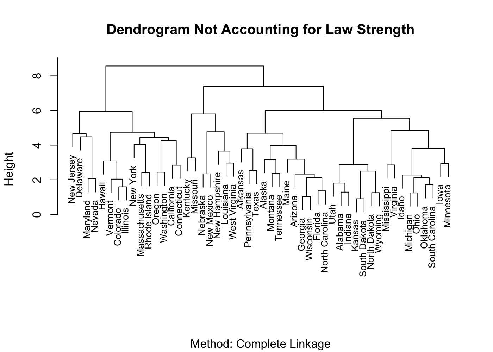
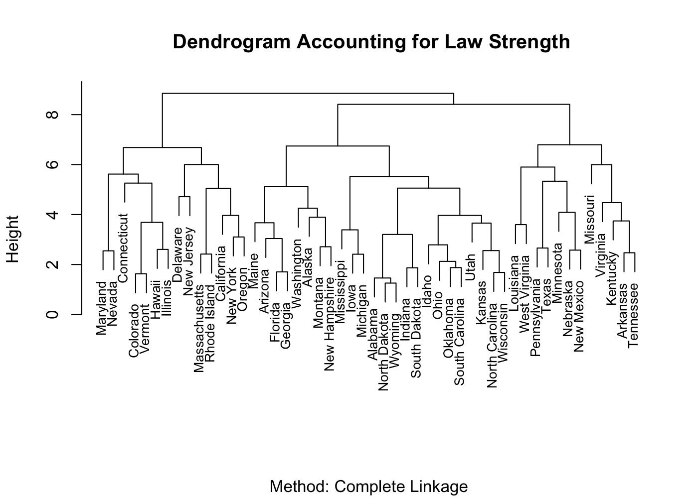
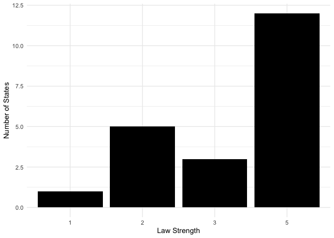
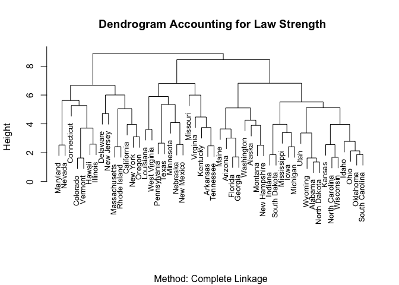
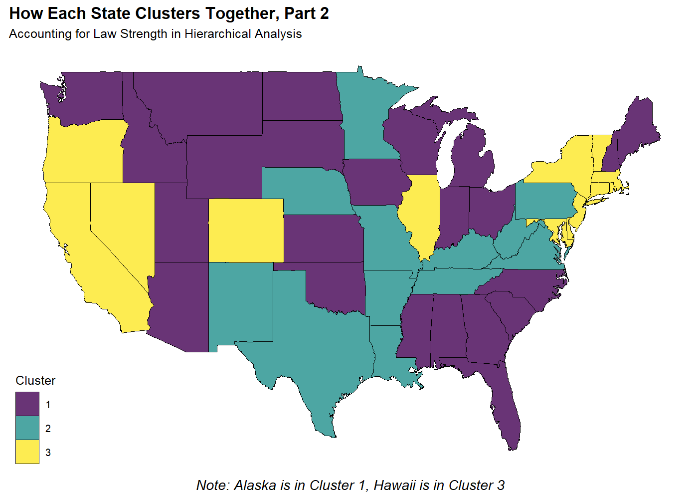
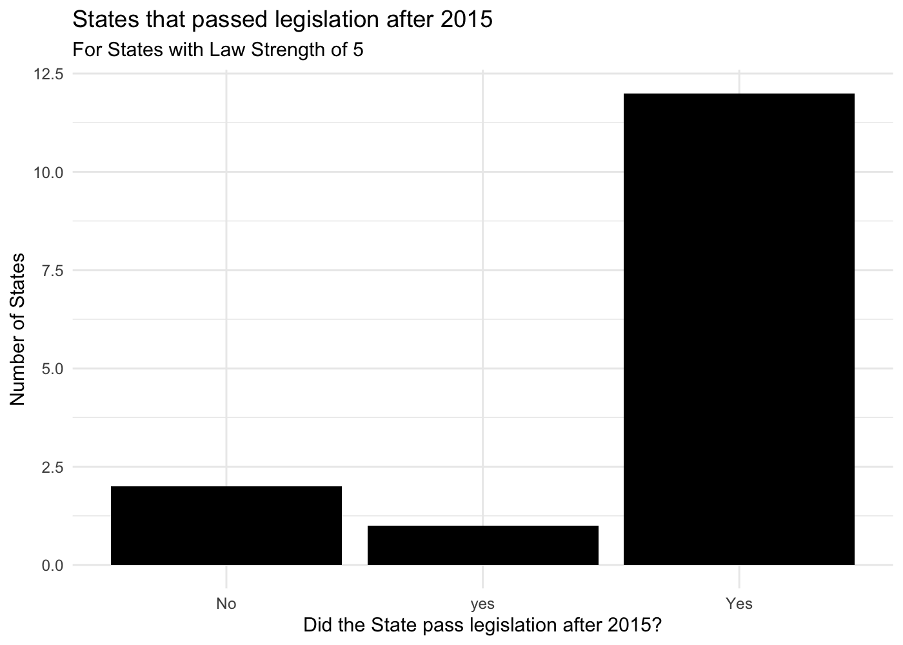
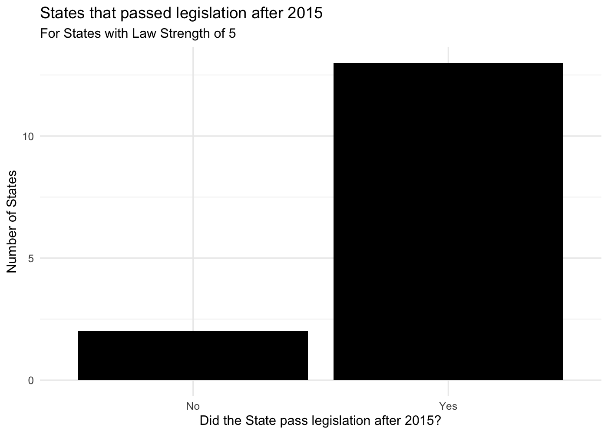
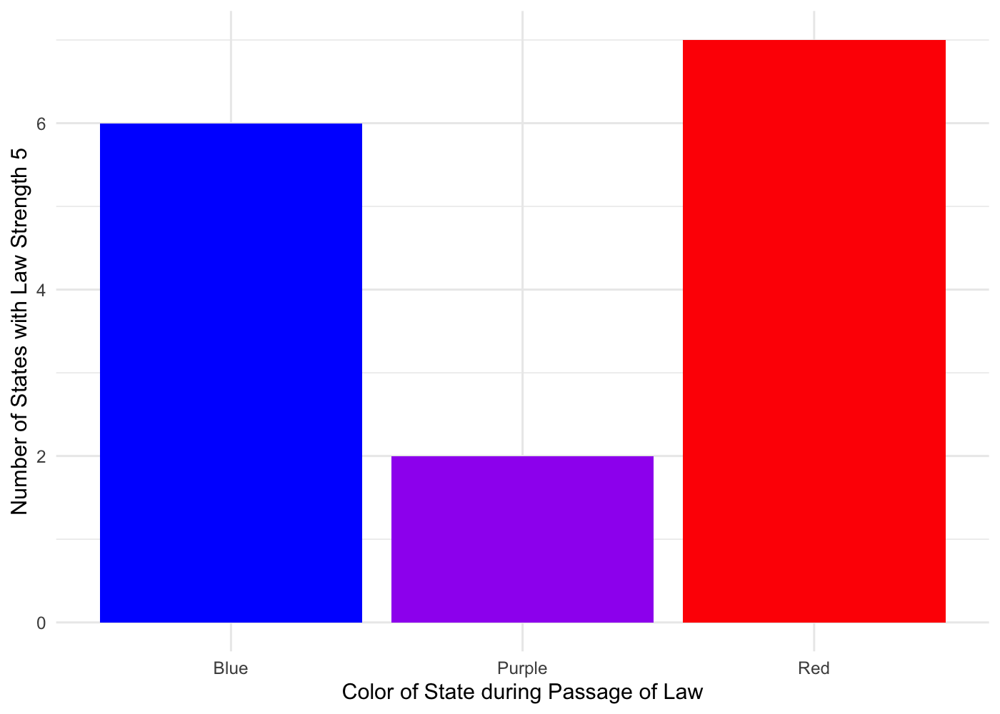
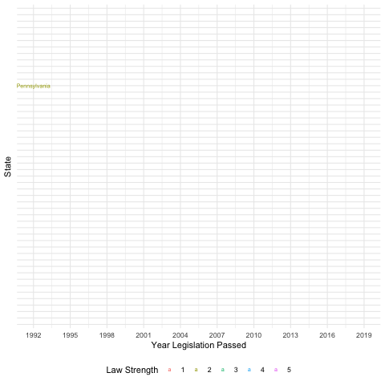

```r
library(gganimate)
library(ggmap)
library(ggridges)
library(ggthemes)
library(knitr)
library(leaflet)
library(lubridate)
library(plotly)
library(scales)
library(tidyverse)
library(tibble)
library(skimr)
library(naniar)
library(gridExtra)
```


# Introduction

* Info on motivation for looking into this data set
* explain where data came from
* outline research question

## Codebook

Variable                    Meaning
--------------------------  --------
`state`                     identifying variable
`pop`                       size of population
`lgl_abortion_clinics`      Number of legal abortion clinics available to women in the state
`health_clinics`            women's health clinics that do not provide abortion services
`prop_abortion`             the ratio of people per abortion clinic in the state (bigger numbers mean presumably less access)
`prop_health`               the ratio of people per women's health clinic in the state (bigger numbers mean presumably less access)
`paid_fam_leave`            whether a state has a law requiring an employer to issue paid family leave (women are disproportionately affected by paid family leave or lack thereof because they're the ones having babies!)
`prop_equal_pay`            how many cents women make to the dollar that men make in each state
`equal_pay_rank`            how a state ranks nationally according to equal pay laws
`marital_rape_except`       whether a state has loopholes in sexual assault in the cases of marriage
`law strength`              metric to assign to the strength of the legislation: 5 = clear and convincing, 4 = beyond reasonable doubt, 3 = not specified, 2 = conviction, 1 = nothing				
`year_passage`              when the bill (to terminate parental rights in cases of rape that resulted in child's conception) was initially passed
`year_amend`                when/if the bill was amended to expand restrictions from requiring a rape conviction to clear and convincing evidence
`post_2015`                 whether the bill was passed before or after 2015, when the Obama Administration issued grant money to any state that made this issue a legislative priority
`bill_name`                 name of legaislation passed in the state
`perc_women`                percent of women 
`perc_demo_senate`	        percent of members in the state senate that are of the Democratic party
`perc_demo_house`	          percent of members in the state house that are of the Democratic party
`Senate`	                  party that controlled state senate during the passage of the legislation; D = Democrat, R = Republican, P = Split, B = Bipartisan, N/A = Does not apply (legislation not passed)
`House`	                    party that controlled state house during the passage of the legislation
`Governor`                  governor's party affiliation


```r
data <- read_csv("Honors_stats_updated_nov18_2.csv")
data <- data %>%
  select(-X22)

data
```

<div data-pagedtable="false">
  <script data-pagedtable-source type="application/json">
{"columns":[{"label":["State"],"name":[1],"type":["chr"],"align":["left"]},{"label":["Pop"],"name":[2],"type":["dbl"],"align":["right"]},{"label":["lgl_abortion_clinics"],"name":[3],"type":["dbl"],"align":["right"]},{"label":["health_clinics"],"name":[4],"type":["dbl"],"align":["right"]},{"label":["prop_abortion"],"name":[5],"type":["dbl"],"align":["right"]},{"label":["prop_health"],"name":[6],"type":["dbl"],"align":["right"]},{"label":["paid_fam_leave"],"name":[7],"type":["chr"],"align":["left"]},{"label":["prop_equal_pay"],"name":[8],"type":["dbl"],"align":["right"]},{"label":["equal_pay_rank"],"name":[9],"type":["dbl"],"align":["right"]},{"label":["marital_rape_except"],"name":[10],"type":["chr"],"align":["left"]},{"label":["law_strength"],"name":[11],"type":["dbl"],"align":["right"]},{"label":["year_passage"],"name":[12],"type":["dbl"],"align":["right"]},{"label":["year_amend"],"name":[13],"type":["dbl"],"align":["right"]},{"label":["post_2015"],"name":[14],"type":["chr"],"align":["left"]},{"label":["bill_name"],"name":[15],"type":["chr"],"align":["left"]},{"label":["perc_women"],"name":[16],"type":["dbl"],"align":["right"]},{"label":["perc_demo_senate"],"name":[17],"type":["dbl"],"align":["right"]},{"label":["perc_demo_house"],"name":[18],"type":["dbl"],"align":["right"]},{"label":["Senate"],"name":[19],"type":["chr"],"align":["left"]},{"label":["House"],"name":[20],"type":["chr"],"align":["left"]},{"label":["Governor"],"name":[21],"type":["chr"],"align":["left"]}],"data":[{"1":"Alabama","2":"4874747","3":"3","4":"234","5":"1624916.0","6":"20832.000","7":"no","8":"73","9":"48","10":"no","11":"2","12":"2019","13":"NA","14":"Yes","15":"Ala. Code <e5><U+00A4> 12-15-319/ HB 48","16":"15.7","17":"22.9","18":"26.7","19":"R","20":"R","21":"R"},{"1":"Alaska","2":"738432","3":"3","4":"165","5":"246144.0","6":"4475.345","7":"no","8":"80","9":"26","10":"no","11":"3","12":"2018","13":"NA","14":"No","15":"SB 134","16":"31.7","17":"30.0","18":"40.0","19":"D","20":"R","21":"D"},{"1":"Arizona","2":"6828065","3":"9","4":"183","5":"758674.0","6":"37312.000","7":"no","8":"84","9":"11","10":"no","11":"2","12":"2016","13":"NA","14":"Yes","15":"2016 HB 2488","16":"35.6","17":"43.3","18":"40.0","19":"R","20":"R","21":"R"},{"1":"Arkansas","2":"2978204","3":"1","4":"179","5":"2978204.0","6":"16638.000","7":"no","8":"85","9":"7","10":"no","11":"2","12":"2013","13":"NA","14":"No","15":"Ark. Stat. Ann. <e5><U+00A4> 9-10-121//2013 HB 1002","16":"17.0","17":"40.0","18":"48.0","19":"R","20":"R","21":"D"},{"1":"California","2":"39536653","3":"152","4":"1694","5":"260109.6","6":"23339.228","7":"yes","8":"88","9":"1","10":"no","11":"2","12":"1997","13":"NA","14":"No","15":"Cal. Fam. Code <e5><U+00A4> 3030","16":"22.5","17":"55.0","18":"55.0","19":"D","20":"D","21":"R"},{"1":"Colorado","2":"5456574","3":"21","4":"243","5":"259836.9","6":"22455.037","7":"no","8":"83","9":"20","10":"no","11":"5","12":"2013","13":"2014","14":"No","15":"Colo. Rev. Stat. <e5><U+00A4> 19-5-105.7//2014 HB 1162","16":"41.0","17":"54.3","18":"55.4","19":"D","20":"D","21":"D"},{"1":"Connecticut","2":"3590886","3":"25","4":"231","5":"143635.4","6":"15544.961","7":"yes","8":"84","9":"12","10":"yes","11":"5","12":"2001","13":"2016","14":"Yes","15":"Conn. Gen. Stat. <e5><U+00A4> 17a-112//2016 HB 5605","16":"29.9","17":"58.3","18":"66.2","19":"D","20":"D","21":"R"},{"1":"Delaware","2":"945934","3":"3","4":"13","5":"315311.3","6":"72764.154","7":"no","8":"84","9":"10","10":"no","11":"2","12":"2007","13":"NA","14":"No","15":"Del. Code tit. 13, <e5><U+00A4> 724A","16":"21.6","17":"50.0","18":"50.0","19":"D","20":"R","21":"D"},{"1":"Florida","2":"20271272","3":"71","4":"636","5":"285510.9","6":"31873.069","7":"no","8":"85","9":"8","10":"no","11":"5","12":"2018","13":"NA","14":"Yes","15":"Fla. Stat. <e5><U+00A4> 39.806","16":"26.3","17":"37.5","18":"33.3","19":"R","20":"R","21":"R"},{"1":"Georgia","2":"10214860","3":"17","4":"274","5":"600874.1","6":"37280.511","7":"no","8":"80","9":"24","10":"no","11":"5","12":"2016","13":"NA","14":"Yes","15":"Ga. Code <e5><U+00A4> 19-8-11//2016 SB 331","16":"24.6","17":"30.4","18":"33.9","19":"R","20":"R","21":"R"},{"1":"Hawaii","2":"1427538","3":"4","4":"77","5":"356884.5","6":"18539.455","7":"no","8":"83","9":"17","10":"no","11":"5","12":"2013","13":"2016","14":"Yes","15":"Hawaii Rev. Stat. <e5><U+00A4> 571-61//2013 SB 529//2016 SB 2811","16":"30.3","17":"96.0","18":"86.2","19":"D","20":"D","21":"D"},{"1":"Idaho","2":"1654930","3":"3","4":"129","5":"551643.3","6":"12828.915","7":"no","8":"78","9":"39","10":"yes","11":"3","12":"2005","13":"NA","14":"No","15":"Idaho Code <e5><U+00A4> 16-2005 2005 HB 325","16":"21.7","17":"19.0","18":"19.0","19":"R","20":"R","21":"R"},{"1":"Illinois","2":"12859995","3":"24","4":"670","5":"535833.1","6":"19194.022","7":"no","8":"81","9":"22","10":"no","11":"3","12":"2013","13":"2016","14":"Yes","15":"Ill. Rev. Stat. ch. 750, <e5><U+00A4> 46/622//2013 HB 3128//2016 HB 1531","16":"31.1","17":"67.8","18":"60.2","19":"D","20":"D","21":"D"},{"1":"Indiana","2":"6619680","3":"9","4":"216","5":"735520.0","6":"30646.667","7":"no","8":"75","9":"44","10":"no","11":"5","12":"2016","13":"NA","14":"Yes","15":"Ind. Code <e5><U+00A4> 31-35-3.5-1 et.seq.//2016 HB 1064","16":"20.7","17":"20.0","18":"30.0","19":"R","20":"R","21":"R"},{"1":"Iowa","2":"3123899","3":"12","4":"213","5":"260324.9","6":"14666.192","7":"no","8":"78","9":"37","10":"yes","11":"5","12":"2016","13":"NA","14":"Yes","15":"Iowa Code <e5><U+00A4> 232.116 Iowa Code <e5><U+00A4> 600A.8//2016 HB 2386","16":"22.7","17":"52.0","18":"43.0","19":"D","20":"R","21":"R"},{"1":"Kansas","2":"2911641","3":"4","4":"223","5":"727910.2","6":"13056.686","7":"no","8":"79","9":"36","10":"no","11":"2","12":"2012","13":"NA","14":"No","15":"Kan. Stat. <e5><U+00A4> 38-2271","16":"20.9","17":"20.0","18":"26.4","19":"R","20":"R","21":"R"},{"1":"Kentucky","2":"4454189","3":"1","4":"358","5":"4454189.0","6":"12441.869","7":"no","8":"79","9":"33","10":"no","11":"2","12":"2014","13":"NA","14":"No","15":"Ky. Rev. Stat. <e5><U+00A4> 403.322//Ky. Rev. Stat. <e5><U+00A4> 405.028//2014 SB 108","16":"18.1","17":"36.8","18":"54.0","19":"R","20":"D","21":"D"},{"1":"Louisiana","2":"4670724","3":"5","4":"294","5":"934144.8","6":"15886.816","7":"no","8":"70","9":"51","10":"no","11":"3","12":"2016","13":"NA","14":"Yes","15":"La. Child. Code <e5><U+00A4> 1015//La. Child. Code <e5><U+00A4> 1015.1//La. Child. Code <e5><U+00A4> 1004//La. Child. Code <e5><U+00A4> 1007//2001 SB 1076//2016 HB 1135","16":"15.3","17":"35.9","18":"40.0","19":"D","20":"D","21":"R"},{"1":"Maine","2":"1329328","3":"4","4":"172","5":"332332.0","6":"7728.651","7":"no","8":"83","9":"16","10":"no","11":"5","12":"2016","13":"NA","14":"Yes","15":"Me. Rev. Stat. Ann. tit. 19-A, <e5><U+00A4> 1658//2016 SB 575","16":"29.6","17":"42.9","18":"51.0","19":"R","20":"D","21":"R"},{"1":"Maryland","2":"6052177","3":"25","4":"132","5":"242087.1","6":"45849.826","7":"no","8":"86","9":"4","10":"yes","11":"5","12":"2018","13":"NA","14":"Yes","15":"Md. Family Law Code Ann. <e5><U+00A4> 5-1402//2018 MD H 1//2018 MD S 2","16":"32.4","17":"70.0","18":"65.0","19":"D","20":"D","21":"R"},{"1":"Massachusetts","2":"6859819","3":"10","4":"270","5":"685981.9","6":"25406.737","7":"yes","8":"83","9":"15","10":"no","11":"2","12":"2014","13":"NA","14":"No","15":"Mass. Gen. Laws Ann. ch. 209C, <e5><U+00A4> 3","16":"24.5","17":"90.0","18":"82.0","19":"D","20":"D","21":"D"},{"1":"Michigan","2":"9962311","3":"20","4":"421","5":"498115.5","6":"23663.447","7":"no","8":"79","9":"34","10":"yes","11":"5","12":"2016","13":"NA","14":"Yes","15":"Mich. Comp. Laws <e5><U+00A4> 722.25//2016 HB 4481//Mich. Comp. Laws <e5><U+00A4> 722.1445 2016 SB 858","16":"20.3","17":"29.0","18":"41.8","19":"R","20":"R","21":"R"},{"1":"Minnesota","2":"5576606","3":"6","4":"421","5":"929434.3","6":"13246.095","7":"no","8":"83","9":"18","10":"yes","11":"1","12":"NA","13":"NA","14":"NA","15":"NA","16":"NA","17":"NA","18":"NA","19":"N/A","20":"N/A","21":"N/A"},{"1":"Mississippi","2":"2992333","3":"1","4":"377","5":"2992333.0","6":"7937.223","7":"no","8":"75","9":"43","10":"yes","11":"5","12":"2017","13":"NA","14":"Yes","15":"Miss. Code <e5><U+00A4> 93-15-119//2017 SB 2342","16":"14.9","17":"38.5","18":"39.3","19":"R","20":"R","21":"R"},{"1":"Missouri","2":"6083672","3":"1","4":"588","5":"6083672.0","6":"10346.381","7":"no","8":"78","9":"38","10":"no","11":"2","12":"1997","13":"2018","14":"No","15":"Mo. Rev. Stat. <e5><U+00A4> 211.447//1997 HB 343//SB 800","16":"21.3","17":"79.2","18":"53.7","19":"D","20":"D","21":"D"},{"1":"Montana","2":"1032949","3":"5","4":"130","5":"206589.8","6":"7945.762","7":"no","8":"77","9":"41","10":"no","11":"5","12":"2017","13":"NA","14":"yes","15":"Mont. Code Ann. <e5><U+00A4> 41-3-801; <e5><U+00A4> 41-3-607//2017 SB 22","16":"28.7","17":"36.0","18":"41.0","19":"R","20":"R","21":"D"},{"1":"Nebraska","2":"1920076","3":"3","4":"167","5":"640025.3","6":"11497.461","7":"no","8":"80","9":"27","10":"no","11":"2","12":"2006","13":"NA","14":"No","15":"Neb. Rev. Stat. <e5><U+00A4> 43-292","16":"16.0","17":"NA","18":"NA","19":"B","20":"B","21":"R"},{"1":"Nevada","2":"2890845","3":"8","4":"40","5":"361355.6","6":"72271.125","7":"no","8":"86","9":"5","10":"yes","11":"3","12":"2017","13":"NA","14":"Yes","15":"Nev. Rev. Stat. <e5><U+00A4> 128.105//2017 AB 228","16":"39.7","17":"52.4","18":"64.3","19":"D","20":"D","21":"R"},{"1":"New Hampshire","2":"1330608","3":"4","4":"52","5":"332652.0","6":"25588.615","7":"no","8":"74","9":"45","10":"no","11":"4","12":"2017","13":"NA","14":"yes","15":"N.H. Rev. Stat. Ann. <e5><U+00A4> 170-C:5-a//2014 SB 253;//2017 SB 166","16":"29.5","17":"41.7","18":"43.8","19":"R","20":"D","21":"D"},{"1":"New Jersey","2":"8958013","3":"41","4":"130","5":"218488.1","6":"68907.792","7":"yes","8":"79","9":"35","10":"no","11":"2","12":"2013","13":"NA","14":"No","15":"N.J. Stat. Ann. <e5><U+00A4> 9:2-4.1","16":"29.2","17":"60.0","18":"60.0","19":"D","20":"D","21":"R"},{"1":"New Mexico","2":"2085109","3":"9","4":"165","5":"231678.8","6":"12637.024","7":"no","8":"84","9":"13","10":"no","11":"3","12":"2011","13":"NA","14":"No","15":"N.M. Stat. <e5><U+00A4> 32A-5-19","16":"26.3","17":"64.3","18":"52.9","19":"D","20":"D","21":"R"},{"1":"New York","2":"19795791","3":"95","4":"625","5":"208376.7","6":"31673.266","7":"yes","8":"88","9":"2","10":"no","11":"2","12":"2013","13":"NA","14":"No","15":"N.Y. Dom. Rel. <e5><U+00A4> 240//2013 SB 5069","16":"22.1","17":"52.4","18":"71.3","19":"R","20":"D","21":"D"},{"1":"North Carolina","2":"10042802","3":"16","4":"294","5":"627675.1","6":"34159.190","7":"no","8":"83","9":"14","10":"no","11":"2","12":"2012","13":"NA","14":"No","15":"N.C. Gen. Stat. <e5><U+00A4> 7B-1111//2012 HB 235","16":"18.5","17":"38.0","18":"43.3","19":"R","20":"R","21":"R"},{"1":"North Dakota","2":"756927","3":"1","4":"71","5":"756927.0","6":"10660.944","7":"no","8":"73","9":"47","10":"no","11":"2","12":"2019","13":"NA","14":"Yes","15":"N.D. Cent. Code <e5><U+00A4> 27-20-44 2019 SB 2185","16":"21.3","17":"21.3","18":"16.0","19":"R","20":"R","21":"R"},{"1":"Ohio","2":"11613423","3":"12","4":"280","5":"967785.2","6":"41476.511","7":"no","8":"79","9":"31","10":"yes","11":"2","12":"2014","13":"NA","14":"No","15":"Ohio Rev. Code <e5><U+00A4> 3109.50 et.seq.//2014 SB 207","16":"23.5","17":"30.3","18":"39.4","19":"R","20":"R","21":"R"},{"1":"Oklahoma","2":"3930864","3":"3","4":"129","5":"1310288.0","6":"30472.000","7":"no","8":"76","9":"42","10":"yes","11":"3","12":"2014","13":"NA","14":"No","15":"Okla. Stat. tit. 10A, <e5><U+00A4> 1-4-904","16":"13.4","17":"25.0","18":"28.7","19":"R","20":"R","21":"R"},{"1":"Oregon","2":"4028977","3":"15","4":"273","5":"268598.5","6":"14758.158","7":"yes","8":"84","9":"9","10":"no","11":"2","12":"2011","13":"NA","14":"No","15":"Or. Rev. Stat. <e5><U+00A4> 419B.510//2011 SB 522","16":"25.6","17":"53.3","18":"50.0","19":"D","20":"P","21":"D"},{"1":"Pennsylvania","2":"12805537","3":"20","4":"326","5":"640276.9","6":"39280.788","7":"no","8":"81","9":"21","10":"no","11":"2","12":"1992","13":"2015","14":"Yes","15":"Pa. Cons. Stat. tit. 23, <e5><U+00A4> 5329//Pa. Cons. Stat. tit. 23, <e5><U+00A4> 4321//1992 HB 79//2015 SB 663","16":"9.5","17":"50.0","18":"51.7","19":"P","20":"D","21":"D"},{"1":"Rhode Island","2":"1056298","3":"3","4":"46","5":"352099.3","6":"22963.000","7":"yes","8":"83","9":"19","10":"yes","11":"2","12":"2013","13":"NA","14":"No","15":"R.I. Gen. Laws <e5><U+00A4> 15-5-16//2013 SB 43//2013 HB 6231","16":"27.4","17":"84.2","18":"92.0","19":"D","20":"D","21":"D"},{"1":"South Carolina","2":"4896146","3":"3","4":"268","5":"1632048.7","6":"18269.201","7":"no","8":"80","9":"29","10":"yes","11":"2","12":"2013","13":"NA","14":"No","15":"S.C. Code <e5><U+00A4> 63-7-2570","16":"12.9","17":"39.1","18":"37.1","19":"R","20":"R","21":"R"},{"1":"South Dakota","2":"858469","3":"1","4":"103","5":"858469.0","6":"8334.650","7":"no","8":"78","9":"40","10":"no","11":"5","12":"2019","13":"NA","14":"Yes","15":"S.D. Codified Laws <e5><U+00A4> 25-4A-20//2019 SB 143","16":"23.8","17":"14.3","18":"15.7","19":"R","20":"R","21":"R"},{"1":"Tennessee","2":"6600299","3":"7","4":"267","5":"942899.9","6":"24720.221","7":"no","8":"80","9":"25","10":"no","11":"2","12":"2010","13":"NA","14":"No","15":"Tenn. Code Ann. <e5><U+00A4> 36-1-113 2010 HB 4139","16":"17.2","17":"42.4","18":"47.5","19":"R","20":"R","21":"D"},{"1":"Texas","2":"27469114","3":"20","4":"732","5":"1373455.7","6":"37526.112","7":"no","8":"80","9":"23","10":"no","11":"2","12":"1997","13":"2017","14":"Yes","15":"Tex. Fam. Code <e5><U+00A4> 161.007//1997 HB 1091//Tex. Fam. Code <e5><U+00A4> 161.001//2017 SB 77","16":"18.2","17":"48.4","18":"54.7","19":"R","20":"D","21":"R"},{"1":"Utah","2":"2995919","3":"2","4":"61","5":"1497959.5","6":"49113.426","7":"no","8":"74","9":"46","10":"no","11":"2","12":"2013","13":"NA","14":"No","15":"Utah Code Ann. <e5><U+00A4> 76-5-414//2013 HB 152","16":"16.3","17":"17.2","18":"18.7","19":"R","20":"R","21":"R"},{"1":"Vermont","2":"623657","3":"6","4":"76","5":"103942.8","6":"8206.013","7":"no","8":"85","9":"6","10":"no","11":"5","12":"2014","13":"NA","14":"No","15":"Vt. Stat. Ann. tit. 15, <e5><U+00A4> 665//2014 HB 88//2017 HB 603","16":"40.6","17":"70.0","18":"62.0","19":"D","20":"D","21":"D"},{"1":"Virginia","2":"8470020","3":"2","4":"181","5":"4235010.0","6":"46795.691","7":"no","8":"79","9":"30","10":"yes","11":"2","12":"2006","13":"NA","14":"No","15":"Va. Code <e5><U+00A4> 20-124.1","16":"15.0","17":"41.0","18":"41.0","19":"R","20":"R","21":"R"},{"1":"Washington","2":"7405743","3":"33","4":"393","5":"224416.5","6":"18844.130","7":"yes","8":"79","9":"32","10":"no","11":"5","12":"2017","13":"NA","14":"Yes","15":"HB 1543","16":"36.7","17":"51.0","18":"51.0","19":"D","20":"P","21":"D"},{"1":"West Virginia","2":"1844128","3":"1","4":"317","5":"1844128.0","6":"5817.438","7":"no","8":"71","9":"49","10":"no","11":"3","12":"2014","13":"NA","14":"No","15":"HB 4139","16":"16.4","17":"70.6","18":"53.0","19":"D","20":"D","21":"D"},{"1":"Wisconsin","2":"5771337","3":"4","4":"162","5":"1442834.2","6":"35625.537","7":"no","8":"80","9":"28","10":"no","11":"3","12":"2011","13":"NA","14":"No","15":"Wis. Stat. Ann. <e5><U+00A4> 48.415","16":"22.6","17":"42.4","18":"38.4","19":"R","20":"R","21":"R"},{"1":"Wyoming","2":"579315","3":"1","4":"33","5":"579315.0","6":"17555.000","7":"no","8":"70","9":"50","10":"no","11":"1","12":"2019","13":"NA","14":"Yes","15":"HB 107","16":"15.6","17":"10.0","18":"15.0","19":"R","20":"R","21":"R"}],"options":{"columns":{"min":{},"max":[10]},"rows":{"min":[10],"max":[10]},"pages":{}}}
  </script>
</div>


# Preliminary Analysis: Clustering

To begin answering our research question, we first were interested in understanding how states are similar in their state legislatures and other variables that may account for how they enact the legislation we are interested in looking at. As such, we use hierarchical clustering analysis to find structure in our data and determine states that are similar with regards to the features outlined above. Our research question focuses on understanding factors that may influence how this legislation is enforced; as a result, we do not factor in the actual strength of the law we coded above or the year in which it was passed. This is because we are interested in seeing if the variables in this data set have a relationship with what the strength of the legislation actually is.

For this analysis, we have to convert the variables that are factors into numeric data. As such, this is how the variables were coded:

* `Senate`, `House` & `Governor` variables: 1 = Bipartisan (B), 2 = Democratic (D), 3 = Purple (P), 4 = Legislation not passed (N/A), 5 = Republican (R)

* `paid_fam_leave` & `marital_rape_except` variables: 1 = "No", 2 = "Yes"

Additionally, it is also important to note why we also excluded the variables that indicate population of the state, number of legal abortion clinics available to women in the state and the number of women's health clinics in the state. We did not want to size of the state to affect the results of the clustering analysis. So to account for this, we left the variables of `prop_abortion` and `prop_health` in the algorithm because this places all states on the same scale by computing the ratio of people per abortion clinic and people to health clinics, respectively. These are the most important variables since we are trying to find similarities in resources available, and not simply the size of the state, for example.

Coding the variables above as such will allow us to see the break down of these variables when summarizing variable means across clusters once clusters have been determined. We used the complete linkage approach to find similarities between clusters of states, which is defined as the maximum distance between any 2 cases between any 2 clusters. After running the hierarchical clustering algorithm and visualizing the resultant dendrogram (i.e. when clusters merge and which states merge into what clusters), we determined that the appropriate number of natural clusters was 4 and better visualized these four clusters on a states map, as seen below.


```r
# Intitial clustering w/o taking into account year passage
my_cluster_data <- data %>% 
  select(-c(bill_name, year_amend, post_2015, law_strength, year_passage, Pop, lgl_abortion_clinics, health_clinics))  %>%
  mutate(Senate = as.numeric(factor(Senate)),
         House = as.numeric(factor(House)),
         Governor = as.numeric(factor(Governor)),
         paid_fam_leave = as.numeric(factor(paid_fam_leave)),
         marital_rape_except = as.numeric(factor(marital_rape_except))) %>%
  column_to_rownames("State")

# Hierarchical clustering
# method can be "complete", "single", "average", "centroid"
hier_model <- hclust(dist(scale(my_cluster_data)), method = "complete")

# Visualization: dendrogram
plot(hier_model, cex = 0.8, xlab = "", main = "Dendrogram Not Accounting for Law Strength", 
     sub = "Method: Complete Linkage")

# Assign each sample case to a cluster
# You specify the number of clusters, k
clusters <- as.factor(cutree(hier_model, k = 3))
```




```r
# Mapping initial clustering results
states_map <- map_data("state")

data %>% 
  mutate(cluster = clusters,
         State = tolower(State)) %>%
  ggplot(aes(fill = cluster)) +
  geom_map(aes(map_id = State), color = "black", size = 0.1, alpha = 0.8, map = states_map) +
  expand_limits(x = states_map$long, y = states_map$lat) +
  theme_map() +
  scale_fill_viridis_d() +
  labs(fill = "Cluster", title = "How Each State Clusters Together, Part 1", 
       subtitle = "Results from Hierarchical Analysis before accounting for law strength",
       caption = "Note: Alaska is in Cluster 1, Hawaii is in Cluster 2") + 
  theme(plot.title = element_text(face = "bold", size = 12),
        plot.caption = element_text(face = "italic", hjust = 0.5, size = 10))

# Calculating the mean of each feature for each cluster when there are 2 clusters
my_cluster_data %>%
  mutate(cluster = clusters) %>% group_by(cluster) %>%
  summarize_all(list(mean = mean), na.rm = TRUE)
```

<div data-pagedtable="false">
  <script data-pagedtable-source type="application/json">
{"columns":[{"label":["cluster"],"name":[1],"type":["fctr"],"align":["left"]},{"label":["prop_abortion_mean"],"name":[2],"type":["dbl"],"align":["right"]},{"label":["prop_health_mean"],"name":[3],"type":["dbl"],"align":["right"]},{"label":["paid_fam_leave_mean"],"name":[4],"type":["dbl"],"align":["right"]},{"label":["prop_equal_pay_mean"],"name":[5],"type":["dbl"],"align":["right"]},{"label":["equal_pay_rank_mean"],"name":[6],"type":["dbl"],"align":["right"]},{"label":["marital_rape_except_mean"],"name":[7],"type":["dbl"],"align":["right"]},{"label":["perc_women_mean"],"name":[8],"type":["dbl"],"align":["right"]},{"label":["perc_demo_senate_mean"],"name":[9],"type":["dbl"],"align":["right"]},{"label":["perc_demo_house_mean"],"name":[10],"type":["dbl"],"align":["right"]},{"label":["Senate_mean"],"name":[11],"type":["dbl"],"align":["right"]},{"label":["House_mean"],"name":[12],"type":["dbl"],"align":["right"]},{"label":["Governor_mean"],"name":[13],"type":["dbl"],"align":["right"]}],"data":[{"1":"1","2":"1092623.9","3":"24075.71","4":"1.000000","5":"78.82143","6":"30.64286","7":"1.321429","8":"20.67407","9":"32.62593","10":"35.57778","11":"4.678571","12":"4.607143","13":"2.607143"},{"1":"2","2":"302463.8","3":"32047.79","4":"1.533333","5":"83.73333","6":"13.93333","7":"1.266667","8":"30.30667","9":"64.31333","10":"64.70667","11":"2.200000","12":"2.466667","13":"1.666667"},{"1":"3","2":"2074355.7","3":"13459.37","4":"1.000000","5":"76.57143","6":"36.57143","7":"1.000000","8":"20.41429","9":"54.75000","10":"49.56667","11":"2.714286","12":"1.857143","13":"1.857143"}],"options":{"columns":{"min":{},"max":[10]},"rows":{"min":[10],"max":[10]},"pages":{}}}
  </script>
</div>

From this map, we are able to visualize the which states are similar in terms of their representation in the state legislatures and the resources available in each state that may affect how legislation is enforced. We can define the four clusters seen above as the following, based on the means for each variable within each cluster:

* **Cluster 1**: States whose representation in the state legislature is Republican favored and has the second to worst representation of women. It is a tier below Cluster 2 and a tier higher than Cluster 3 in terms of "equality" for women.

* **Cluster 2**: States whose representation in the state legislature is strongly Democratic favored and has the highest representation of women. These states also have the most "equality" for women, most access to abortion and health clinics. (Best in regards to our research question).

* **Cluster 3**: States whose representation in the state legislature is for the most part split, with representation of women the lowest out of the three clusters and the worst in terms of "equality" for women. (Worst in regards to our research question).

Taking into account the metric above in our cluster analysis, we want to compare how each state *actually* rules on this legislation to how they seem that they would on paper based on the variables above. As such, we created another map that shows the law strength for each state, with 1 being the "worst" (i.e.nothing in place) and 5 being the best (i.e. clear and convincing).


```r
# Mapping states and law strength
data %>%
  mutate(State = tolower(State)) %>%
  ggplot(aes(fill = factor(law_strength))) +
  geom_map(aes(map_id = State), color = "black", size = 0.1, alpha = 0.8, map = states_map) +
  expand_limits(x = states_map$long, y = states_map$lat) +
  theme_map() +
  scale_fill_viridis_d() +
  labs(fill = "Law Strength", title = "Law Strength for Each State", 
       subtitle = "How States Actually Treat Legislation",
       caption = "Note: Alaska is 3, Hawaii is 5") + 
  theme(plot.title = element_text(face = "bold", size = 12),
        plot.caption = element_text(face = "italic", hjust = 0.5, size = 10))
```



**QUESTIONS FROM EMMA:** 

*1. funny that wyoming is grouped with MN for law strength, since 1 is coded as "no law", and WY does have a law, albeit low in strength, any idea for why this might be?? *


Comparing the two maps above, we find some surprising results. For example, the group of West Coast and some East Coast states that were coded as being in Cluster 2 - the best cluster - only have a strength of 2 for the legislation they have in place. Based on the clustering performed above, we would expect these states to have a strong legislation since they seem to be most progressive and have the most representation for women liberal ideals. Conversely, we see that states such as Florida, Mississippi and Georgia who were placed in Cluster 1 or Cluster 2 - the worse clusters - have much better law strengths. 

There are many possible explanations for this effect. One of them may be that those states in which have lower "equality" for women may need to have stronger laws in place to protect them because of their "make-up" in terms of treatment towards women. (NEED EMMA FOR THIS PART)


Bringing it all together and now accounting for the year in which the legislation in question was passed and the strength of the law, we re-run our clustering algorithm to see how states are similar to each other in a more hollistic view, accounting for both what we expected their attitudes towards this legislation to be and the reality for the legislation in these states. Again, we determined their to be 3 "natural" clusters and visualized these groups on the map once again.


```r
# Hierarchical Analysis using all information
my_cluster_data2 <- data %>% 
  select(-c(bill_name, year_amend, Pop, lgl_abortion_clinics, health_clinics))  %>%
  mutate(Senate = as.numeric(factor(Senate)),
         House = as.numeric(factor(House)),
         Governor = as.numeric(factor(Governor)),
         post_2015 = as.numeric(factor(post_2015)),
         paid_fam_leave = as.numeric(factor(paid_fam_leave)),
         marital_rape_except = as.numeric(factor(marital_rape_except))) %>%
  column_to_rownames("State")

# Hierarchical clustering
# method can be "complete", "single", "average", "centroid"
hier_model2 <- hclust(dist(scale(my_cluster_data2)), method = "complete")

# Visualization: dendrogram
plot(hier_model2, cex = 0.8, xlab = "", main = " Dendrogram Accounting for Law Strength", 
     sub = "Method: Complete Linkage")

# Assign each sample case to a cluster
# You specify the number of clusters, k
clusters2 <- as.factor(cutree(hier_model2, k = 3))
```




```r
# Calculating the mean of each feature for each cluster when there are 3 clusters
my_cluster_data2 %>%
  mutate(cluster = clusters2) %>% group_by(cluster) %>%
  summarize_all(list(mean = mean), na.rm = TRUE)

# Mapping Clusters when accounting for law strength and year passage
data %>% 
  mutate(cluster = clusters2,
         State = tolower(State)) %>%
  ggplot(aes(fill = cluster)) +
  geom_map(aes(map_id = State), color = "black", size = 0.1, alpha = 0.8, map = states_map) +
  expand_limits(x = states_map$long, y = states_map$lat) +
  theme_map() +
  scale_fill_viridis_d() +
  labs(fill = "Cluster", title = "How Each State Clusters Together, Part 2", 
       subtitle = "Accounting for Law Strength in Hierarchical Analysis",
       caption = "Note: Alaska is in Cluster 1, Hawaii is in Cluster 3") + 
  theme(plot.title = element_text(face = "bold", size = 12),
        plot.caption = element_text(face = "italic", hjust = 0.5, size = 10))
```

<div data-pagedtable="false">
  <script data-pagedtable-source type="application/json">
{"columns":[{"label":["cluster"],"name":[1],"type":["fctr"],"align":["left"]},{"label":["prop_abortion_mean"],"name":[2],"type":["dbl"],"align":["right"]},{"label":["prop_health_mean"],"name":[3],"type":["dbl"],"align":["right"]},{"label":["paid_fam_leave_mean"],"name":[4],"type":["dbl"],"align":["right"]},{"label":["prop_equal_pay_mean"],"name":[5],"type":["dbl"],"align":["right"]},{"label":["equal_pay_rank_mean"],"name":[6],"type":["dbl"],"align":["right"]},{"label":["marital_rape_except_mean"],"name":[7],"type":["dbl"],"align":["right"]},{"label":["law_strength_mean"],"name":[8],"type":["dbl"],"align":["right"]},{"label":["year_passage_mean"],"name":[9],"type":["dbl"],"align":["right"]},{"label":["post_2015_mean"],"name":[10],"type":["dbl"],"align":["right"]},{"label":["perc_women_mean"],"name":[11],"type":["dbl"],"align":["right"]},{"label":["perc_demo_senate_mean"],"name":[12],"type":["dbl"],"align":["right"]},{"label":["perc_demo_house_mean"],"name":[13],"type":["dbl"],"align":["right"]},{"label":["Senate_mean"],"name":[14],"type":["dbl"],"align":["right"]},{"label":["House_mean"],"name":[15],"type":["dbl"],"align":["right"]},{"label":["Governor_mean"],"name":[16],"type":["dbl"],"align":["right"]}],"data":[{"1":"1","2":"835469.1","3":"22514.40","4":"1.041667","5":"78.00000","6":"33.79167","7":"1.291667","8":"3.458333","9":"2015.417","10":"2.166667","11":"22.8125","12":"31.32500","13":"33.85417","14":"4.625000","15":"4.708333","16":"2.666667"},{"1":"2","2":"2107259.9","3":"20569.49","4":"1.000000","5":"79.16667","6":"27.91667","7":"1.166667","8":"2.166667","9":"2006.909","10":"1.545455","11":"17.3000","12":"50.86000","13":"49.65000","14":"3.416667","15":"2.750000","16":"1.916667"},{"1":"3","2":"308038.6","3":"32990.91","4":"1.500000","5":"84.07143","6":"12.64286","7":"1.285714","8":"3.214286","9":"2011.214","10":"1.714286","11":"29.8500","12":"65.26429","13":"65.68571","14":"2.214286","15":"2.357143","16":"1.714286"}],"options":{"columns":{"min":{},"max":[10]},"rows":{"min":[10],"max":[10]},"pages":{}}}
  </script>
</div>

The breakdown in groups is very similar to the original clustering analysis, but assigned to different clusters:

* **Cluster 1**: States whose representation in the state legislature is Republican favored and has the second to worst representation of women. It is a tier below Cluster 3 (the best) and a tier higher than Cluster 3 (worst) in terms of "equality" for women and has the strongest law strength.

* **Cluster 2**: States whose representation in the state legislature is about split and has the worst resources, "equality" and representation for women, with an average law strength of 2 (Worst in our analysis).

* **Cluster 3**: States whose representation in the state legislature is strongly favored towards Democratic and the most representation of women. These states have the most resources for women and the best "equality", with an average law strength of about 3 (Best in our analysis).


# Other things to keep in mind as we make visualizations

* Of the 24 states (nearly half) that passed legislation after 2015, 19 (79.2%) of them do not require a rape conviction for termination of parental rights, and 14 (58.33%) require only clear and convincing evidence to terminate parental rights of rapists.


```r
data %>%
  filter(post_2015 == "Yes") %>%
  ggplot(aes(x = factor(law_strength))) +
  geom_bar(fill = "black") +
  theme_minimal() +
  labs(x = "Law Strength", y = "Number of States")

data %>%
  filter(post_2015 == "Yes") %>%
  group_by(factor(law_strength)) %>%
  count() %>%
  ungroup() %>%
  mutate(prop = n/sum(n)) %>%
  rename(`Law Strength` = "factor(law_strength)", `Number of States` = "n",
         `Proportion (Law Passed after 2015)` = "prop")
```

<div data-pagedtable="false">
  <script data-pagedtable-source type="application/json">
{"columns":[{"label":["Law Strength"],"name":[1],"type":["fctr"],"align":["left"]},{"label":["Number of States"],"name":[2],"type":["int"],"align":["right"]},{"label":["Proportion (Law Passed after 2015)"],"name":[3],"type":["dbl"],"align":["right"]}],"data":[{"1":"1","2":"1","3":"0.04761905"},{"1":"2","2":"5","3":"0.23809524"},{"1":"3","2":"3","3":"0.14285714"},{"1":"5","2":"12","3":"0.57142857"}],"options":{"columns":{"min":{},"max":[10]},"rows":{"min":[10],"max":[10]},"pages":{}}}
  </script>
</div>

**QUESTION FROM EMMA**

*Why are there so few states on here? What exactly is this modeling?*


* There are only 16 states that use “clear and convincing evidence” as a burden of proof for terminating parental rights of rapists, and 14 of those states (87.5%) passed legislation AFTER 2015.


```r
data %>%
  filter(law_strength == 5) %>%
  group_by(post_2015) %>%
  count() %>%
  ggplot(aes(x = post_2015, y = n)) +
  geom_col(fill = "black") +
  theme_minimal() +
  labs(x = "Did the State pass legislation after 2015?", y = "Number of States",
       title = "States that passed legislation after 2015", 
       subtitle = "For States with Law Strength of 5")
```



**QUESTION FROM EMMA**

*What's up with the second yes? just a capitalization mistake?*

* 6 (37.5%) “blue” (majority democratic legislators in the state legislature), 2 (12.5%) “purple” (split between democratic and republican legislators in the state legislature) and 8 (50%) “red” (majority republican legislators in the state legislature) states use the clear and convincing standard. There seems to be no significant variation along party lines with regard to a higher burden of proof.


```r
# Still working this out
data %>%
  filter(law_strength == 5) %>%
  mutate(party = case_when(Senate == "R" & House == "R" ~ "Red",
                           Senate == "D" & House == "D" ~ "Blue"))
```

* 14 states who passed legislation to terminate the parental rights of rapists had democratically controlled legislatures at the time of passage, 5 were split, and 30 were republican-controlled.

* 21 states currently require a rape conviction for TPR. Of those states, 4 (19%) were “blue”, 14 (66.67%) were “red”, and 3 (14.29%) were “purple” at the time of passage.

* This shows the distribution of years of when the legislation was passed

```r
data %>%
  ggplot(aes(x = year_passage)) +
  geom_density() +
  theme_minimal()
```

```
## Warning: Removed 1 rows containing non-finite values (stat_density).
```



* This shows when each state passed the legislation, going from earliest to latest (we can make a gif out of this!!)


```r
data %>%
  arrange(year_passage) %>%
  ggplot(aes(y = State, x = year_passage, label = State, color = factor(law_strength))) +
  geom_text(size = 2.5) +
  theme_minimal() +
  labs(x = "Year Legislation Passed", color = "Law Strength") +
  theme(axis.text.y = element_blank(),
        legend.position = "bottom") +
  scale_x_continuous(breaks = seq(1992, 2020, 3))
```

```
## Warning: Removed 1 rows containing missing values (geom_text).
```





